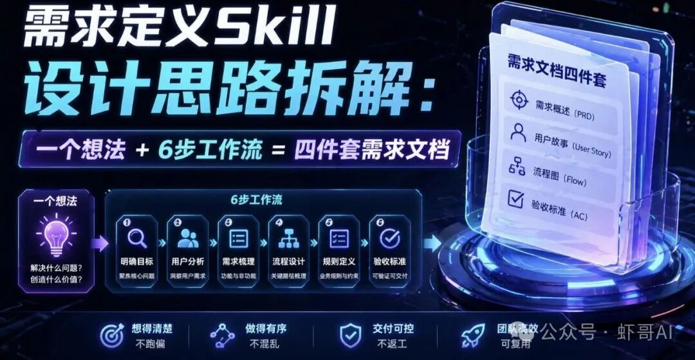

【虾哥导读】

产品经理需求定义Skill设计思路拆解，一个想法+6步工作流等于交付四件套文档（用户画像+MRD+BRD+PRD）。它解决的核心问题是：让AI从"给建议"变成"交付结果"。

## 一、先说场景

你有个创业想法——比如"做一个AI帮人设计图纸的工具"。你兴冲冲打开AI，问它："帮我写个PRD。"

AI确实给你吐了一大堆文字。但你看完之后发现：

•

**不知道用户是谁**——AI随便猜了一个

•

**市场数据全是编的**——看着像真的，其实现编的

•

**功能列表像购物清单**——什么都有，但不知道先做哪个

•

**完全没提"AI挂了怎么办"**——这个坑，AI自己不会跳

问题出在哪？

不是AI不聪明，而是你每次都要从头教它：你是谁、你要做什么、按什么格式写、哪些东西不能漏。教一次还行，教十次你就疯了。

**需求定义Skill就是来解决这个问题的。**

你可以把Skill理解成：给AI塞了一本工作手册。以后你只要说一句"我想做个XX产品"，它就自动按手册里的流程走——收集信息、画用户画像、分析市场、算商业账、写PRD、自检。不用每次重新教，不用担心它漏东西，不用担心它瞎编数据。

## 二、没有Skill时的四个坑

先看一张对比表：

| 坑 | 描述 |
| --- | --- |
|  |  |
| **坑1：方向跑偏** | 很多人上来就想"我要做什么功能"，但没搞清楚"用户到底痛在哪"。这个Skill的核心理念是——先找矛盾，再推方案。矛盾找错了，后面全白干。 |
| **坑2：AI产品维度总是漏** | 普通产品的PRD不用写"模型挂了怎么办"，但AI产品必须写。没人提醒的话，这些关键问题就被跳过了。 |
| **坑3：只有正面论证** | AI写东西天然倾向"这个方案很好"，但从不主动说"这个方案可能会死在哪"。这个Skill强制要求做反面验证和魔鬼代言人检验。 |
| **坑4：文档写完就完了** | 没有自检、没有存档、没有后续验证计划。这个Skill会在最后帮你做一次全面体检。 |

## 三、这个Skill能帮你做什么

**一句话定义：**

你输入一句产品想法 → Skill引导你走完6步 → 输出4份可以拿去评审的文档。

**输入→处理→输出：**

| 阶段 | 内容 |
| --- | --- |
|  |  |
| 输入 | 一句产品想法 |
| 处理 | 6步工作流逐步引导 |
| 输出 | 用户画像 + MRD + BRD + PRD |

**适合什么场景：**

•

新项目立项，需要从0到1梳理需求

•

有个模糊的想法，想系统化地想清楚

•

需要给团队或投资人看的正式文档

**不适合什么场景：**

•

已经有完整PRD，只想改几个字段

•

纯技术方案设计（这个Skill聚焦在"做什么"，不是"怎么实现"）

**和普通问AI的区别：**

| 对比项 | 普通问AI | 这个Skill |
| --- | --- | --- |
|  |  | --- |
| 用户定义 | 每次都要重新说 | 内置模板，不用重复 |
| 文档格式 | 随机生成，看心情 | 强制走模板，输出标准化 |
| 市场数据 | 瞎编概率高 | 要求联网搜索，禁止编造 |
| AI产品专属问题 | 完全忽略 | 强制检查项 |
| 反面验证 | 没有 | 强制要求 |

简单说：**Skill是系统级的能力插件，提示词是一次性消耗品。**

## 四、Skill设计拆解

### 1. frontmatter：Skill的"身份证"

打开SKILL.md，最顶上有一段被`---`包裹的内容，这就是frontmatter，作用是告诉AI：这个Skill叫什么、什么时候该用它。

两个设计要点：

•

`name`用英文短横线命名（如`requirement-definition`），这是Claude Code的规范要求

•

`description`里要写触发关键词，中英文都写。用户说"帮我写个PRD"或"需求梳理"，AI才能匹配到这个Skill

**description写得好不好，直接决定Skill能不能被触发。** 写太笼统，AI不知道什么时候该用；写太窄，很多场景触发不了。

### 2. Role/Goals/Constraints：三件套的分工

| 模块 | 作用 | 比喻 |
| --- | --- | --- |
| --- | --- | --- |
| **Role** | 定义AI的身份和立场 | 告诉AI"你是谁" |
| **Goals** | 明确最终要交付什么 | 告诉AI"你要做成什么事" |
| **Constraints** | 设置边界和规则 | 告诉AI"你不能做什么" |

为什么三个都要写？因为AI没有"常识判断"。你不告诉它"禁止编造市场数据"，它就真的会编。你不告诉它"每步要等用户确认"，它就一口气全输出完。

**Constraints里最重要的几条：**

•

矛盾驱动：每一步都必须回到核心矛盾

•

模板驱动：不能自由发挥格式

•

事实优先：市场数据必须联网搜索

### 3. 内置知识库：为什么模板不写在SKILL.md里

这个Skill有5个模板文件，放在`references/`文件夹下：

•

用户画像模板.md

•

MRD模板.md

•

BRD模板.md

•

PRD模板.md

•

竞品分析模板.md

**为什么不直接写在SKILL.md里？**

因为Skill有一个"按需加载"的机制：

•

AI启动时，只读frontmatter（几十个字，几乎不花钱）

•

用户触发Skill后，才读SKILL.md主体（几千字）

•

到了写用户画像那一步，才去读用户画像模板（又几千字）

这样做的好处：**省Token，也避免一次性塞太多内容导致AI"记不住"。**

如果你发现AI输出的文档格式不对，第一件事检查`references/`文件夹里的模板文件是不是完整的。

### 4. 执行模式：为什么要给用户选择权

这个Skill提供三种模式：

| 模式 | 适用场景 | 特点 |
| --- | --- | --- |
|  |  | --- |
| 完整模式 | 严肃产品立项 | 6步全走，每个环节都有 |
| 精简模式 | 快速验证想法 | 只走核心步骤，跳过详细分析 |
| 单文档模式 | 只需要一份特定文档 | 直接跳到对应步骤 |

**不是所有场景都需要"全套体检"。** 有时候你只是想快速验证一个想法，跑完整流程太重了。给用户选择权，才能让Skill真正好用。

### 5. 6步工作流：为什么是这个顺序

这是整个Skill最核心的设计。6步的顺序不是随便排的，背后有一条清晰的逻辑链：

```
第1步：用户画像 → 第2步：MRD → 第3步：BRD → 第4步：PRD → 第5步：反面验证 → 第6步：自检
```

| 步骤 | 文档输出 | 核心问题 |
| --- | --- | --- |
|  |  |  |
| 第1步 | 用户画像 | 我们在为谁解决问题？ |
| 第2步 | MRD | 这个矛盾真实存在吗？ |
| 第3步 | BRD | 解决这个矛盾能赚钱吗？ |
| 第4步 | PRD | 我们具体要做什么？ |
| 第5步 | 反面验证 | 这个方案可能会死在哪？ |
| 第6步 | 自检清单 | 我们准备好上线了吗？ |

**为什么用户画像在BRD之前？**

很多人习惯先算商业账再想用户。但这个Skill的理念是：**先搞清楚为谁做，再谈能不能赚钱。** 如果用户都没搞清楚，商业模式就是空中楼阁。

**为什么每步都要等用户确认？**

因为需求定义不是AI一个人的事。AI负责结构化输出，但判断对不对、方向准不准，必须由你拍板。一口气全输出完，你根本来不及纠偏。

需求定义的价值不在于快，在于每一步都经过验证。快速出的PRD，大概率要推倒重来。

### 6. 关键规则：为什么必须存在

SKILL.md里有12条"必须遵守"和8条"禁止行为"。看起来很多，但每条都有血泪教训。

| 规则类型 | 典型例子 | 作用 |
| --- | --- | --- |
|  |  | --- |
| 必须遵守 | 必须先完成用户画像才能进入MRD | 保证顺序正确 |
| 必须遵守 | 市场数据必须联网搜索，禁止编造 | 保证数据真实 |
| 必须遵守 | 每步必须等用户确认才能继续 | 保证用户主导 |
| 禁止行为 | 禁止在反面验证前写PRD | 防止跳过关键步骤 |
| 禁止行为 | 禁止编造竞品信息 | 防止虚假分析 |

### 7. Init开场白：第一印象很重要

SKILL.md最后有一段Init，规定了AI被触发后说的第一句话。

为什么要设计这个？因为好的开场白能：

•

让用户知道接下来会发生什么（6步流程预告）

•

降低用户的输入门槛（"简单描述就行"）

•

给出示例，帮用户快速进入状态

## 五、Skill整体架构：五层结构一张图

把这个Skill想象成一栋五层楼，从下往上：

| 楼层 | 模块 | 作用 |
| --- | --- | --- |
|  |  | --- |
| 第1层（地基） | frontmatter | Skill的"身份证"，决定什么时候触发 |
| 第2层 | Role/Goals/Constraints | 定义AI的身份和行事边界 |
| 第3层 | 执行流程 | 6步工作流的顺序和规则 |
| 第4层 | references/ | 按需加载的模板文件 |
| 第5层（屋顶） | Init | AI的第一句话，给用户预期 |

## 六、安装使用：手把手教你装起来

### 文件结构

一个完整的requirement-definition Skill长这样：

```
requirement-definition/  
├── SKILL.md              # 主文件，定义Skill的所有规则  
└── references/           # 模板文件夹  
    ├── 用户画像模板.md  
    ├── MRD模板.md  
    ├── BRD模板.md  
    ├── PRD模板.md  
    └── 竞品分析模板.md
```

### 安装方式

**方式一：项目级安装（只对当前项目生效）**

把整个`requirement-definition/`文件夹放到你项目的`.claude/skills/`下：

# 项目级安装（只对当前项目生效）

```
把你的项目/  
└── .claude/  
    └── skills/  
        └── requirement-definition/   # 整体放这里  
            ├── SKILL.md  
            └── references/
```

**方式二：用户级安装（对所有项目生效）**

放到你电脑的全局目录：

```
C:\Users\你的用户名\.claude\skills\requirement-definition\  
  
~/.claude/skills/requirement-definition/
```

**两个位置都放一份也没问题，项目级会优先生效。**

### 如何触发

装好之后，你不需要做任何特殊操作。直接在Claude Code里说话就行，AI会自动识别并触发。

三个可以直接复制的测试提示词：

```
"我有个想法：做一个AI图纸生成工具，帮我走一遍完整的需求定义流程"  
  
"我想做一个程序员简历优化工具，走精简模式"  
  
"帮我生成一份MRD，目标用户是跨境电商运营"
```

默认走完整模式（6步全走），如果你只想要PRD可以说"单文档模式"，直接跳到对应步骤。

### 常见问题排查

| 问题 | 原因 | 解决方法 |
| --- | --- | --- |
|  |  | --- |
| AI没有触发Skill | description里没有当前关键词 | 检查SKILL.md的description字段 |
| 文档格式不对 | references/里的模板文件不完整 | 检查对应模板文件是否存在 |
| 输出太简略 | 走的精简模式 | 改说"完整模式" |
| 数据像是编的 | 没有联网搜索 | 检查Constraints里是否写了"必须联网搜索" |

## 七、总结

**核心价值一句话：**

让AI从"随便聊聊"变成"按流程办事"，从"给建议"变成"交付结果"。

**适合谁用：**

•

想做AI产品但不知道从哪下手的创业者

•

需要快速产出需求文档的产品经理

•

想系统化思考产品方向的任何人

**学习重点：**

不要死记6步流程。重要的是理解三件事：

•

**为什么从矛盾出发**——矛盾找对了，方向才不会错

•

**为什么要反面验证**——只有正面论证的方案，经不起现实检验

•

**为什么模板和流程要分离**——这是Skill能复用、能维护的关键

学会了这个Skill的设计思路，你也可以用同样的方法，给自己的工作场景做一个专属Skill。

欢迎在评论区聊聊你的想法~

如果这篇文章让你有收获，别忘了点赞、分享、推荐～

也欢迎关注我的公众号，每天有AI最新资讯分享🦐


