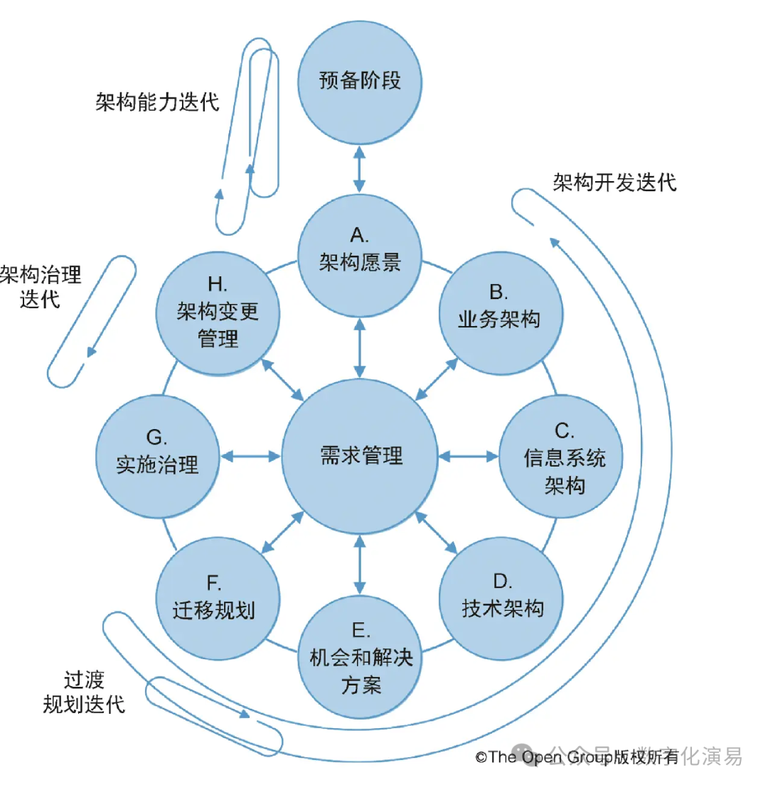

TOGAF（The Open Group Architecture Framework）是全球广受欢迎、较为全面的企业架构框架之一，由The Open Group维护。作为企业架构的行业最佳实践，TOGAF提供了详细的架构开发方法（ADM）以及丰富的最佳实践，可为企业进行企业架构实践时提供规范性指导。本文中，笔者就从主要特征、优点与局限性、实践建议等方面，对TOGAF做一简要介绍。

主要特征

TOGAF最鲜明的特征是其架构开发方法（Architecture Development Method，简称ADM），描述了企业架构的迭代过程。ADM将企业架构的开发过程分为九个阶段：

图1：TOGAF ADM的过程框架

1）预备阶段（Preliminary） ：建立架构能力，定义架构原则，定制TOGAF以适应组织。

2）阶段A：架构愿景（Architecture Vision），定义架构的范围、约束和预期价值，获得利益相关者的认同。

3）阶段B：业务架构（Business Architecture），描述业务战略、治理、组织和关键业务流程。

4）阶段C：信息系统架构（Information Systems Architecture），分为数据架构和应用架构两个并行部分。

5）阶段D：技术架构（Technology Architecture），定义支撑信息系统的基础设施。

6）阶段E：机会与解决方案（Opportunities & Solutions），识别实现目标架构的途径和项目。

7）阶段F：迁移规划（Migration Planning），制定详细的实施路线图和项目组合。

8）阶段G：实施治理（Implementation Governance），确保实施项目与架构一致。

9）阶段H：架构变更管理（Architecture Change Management） ：持续监控架构并管理变更。

ADM支持迭代和循环：企业可以在整体范围内进行迭代，也可以在特定范围内（如某个业务领域）进行多次迭代。

除了ADM，TOGAF还包含：

a）架构内容框架（Architecture Content Framework） ：定义了架构工件的类型（交付物、工件、构建块）及其元模型，这为架构描述提供了标准化的结构。

b）企业连续序列（Enterprise Continuum） ：一个分类机制，用于组织和复用架构资产，包含架构连续序列（从通用到具体）和解决方案连续序列。

c）架构能力框架（Architecture Capability Framework） ：定义了建立和运营架构功能所需的流程、角色和治理机制。

d）架构存储库（Architecture Repository） ：一个逻辑存储库，用于存储架构资产。

优点与局限性

从主要特征可以看出，TOGAF具有以下优点：

1）全面性：TOGAF提供了从战略到实施的完整方法论覆盖，包括流程、内容、能力、治理等多个维度。

2）可定制性：TOGAF明确支持“定制化”，允许组织裁剪ADM、选择相关内容、调整术语以适应自身需求。

3）行业广泛接受：TOGAF拥有全球最大的EA从业者社区，认证人数超过10万，这意味着容易找到有经验的架构师。

4）与其他标准的集成：TOGAF与ArchiMate、ITIL、COBIT、CMMI等标准具有良好的集成关系。

5）免费使用：TOGAF框架本身是免费提供的（但认证考试需要费用），降低了采用门槛。

不过，在架构实践中，TOGAF还存在着如下方面的局限性：

1）学习曲线陡峭：TOGAF文档庞大（核心标准超过500页），初学者需要相当的时间投入才能掌握。

2）规定性强：一些从业者批评其规定性过强、层次过低，偏向详细流程而非高层战略指导。经验丰富的架构师有时会发现TOGAF限制性太强或“过时”。

3）对变革管理的指导有限：TOGAF擅长定义要生产什么工件以及如何构建它们，但没有明确解决转型中更柔和、以人为本的一面（如变革阻力、文化变迁、领导力等）。

4）对敏捷的适配性：虽然TOGAF 10增强了对敏捷的支持，但其“规划驱动”的根源仍然与敏捷的“迭代演进”存在张力。

5）缺少参考模型：TOGAF本身不提供行业特定的参考模型（如制造业的参考架构），组织需要自行开发或寻求其他来源。

实践建议

大体上，TOGAF类似于企业架构的百科全书，如果完全以之来指导企业架构实践，对大多数企业而言则稍显笨重。实际上，好的企业架构实践主要体现为两个方面：架构过程和架构内容，前者明确了企业架构的实现形式（怎么做），后者明确了企业架构实践的交付物（架构构件）。

在架构过程方面，TOGAF ADM是比较完备的，也支持企业根据实际的架构需求做适当的裁剪和持续迭代。在这方面，我们可以给TOGAF ADM打80分以上。

在架构内容方面，TOGAF将企业架构的领域或层次分为业务架构、信息系统架构和技术架构。换句话说，将大家所熟知的数据架构和应用架构合并为信息系统架构。在笔者看来，数据架构更多地表现为业务视角，而不仅仅是信息系统视角。从这个角度来说，TOGAF对架构构件的定义不如Zachman或领域驱动（DDD）框架更有指导性。

综上所述，在企业架构实践中，我们应该将TOGAF ADM与Zachman或DDD进行结合，以TOGAF ADM作为架构过程或形式指导，以DDD作为架构内容或构件指导，这也是华为公司等领先企业在架构实践中所采用的。