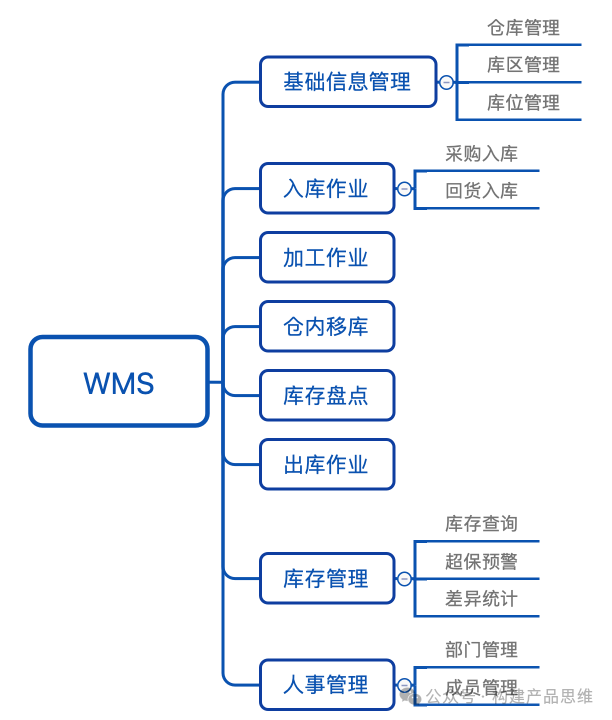
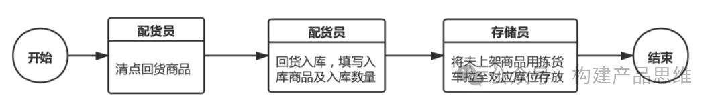
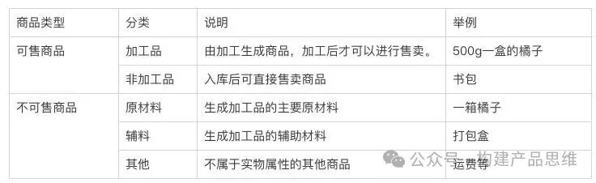
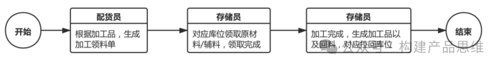
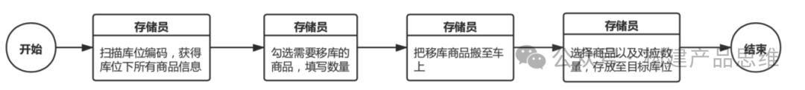
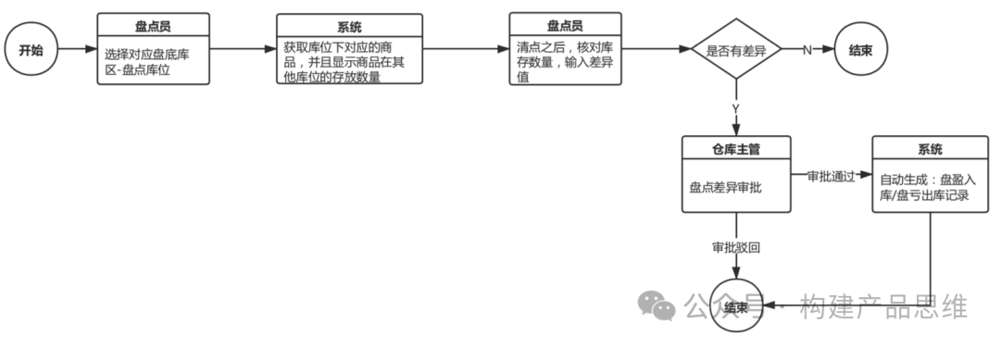
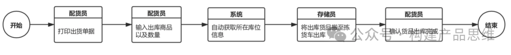

WMS的主要用途是对仓库内所有商品的全面追踪，连接订单管理系统。仓管人员可以随时了解仓库当下最新库存数据。下面基于业务流程顺序，根据生鲜商城为背景，对WMS仓管系统的功能模块进行简要介绍。

1. 业务流

因为生鲜仓库存储物品的类型多种多样，和传统行业不同。商品要依托存储环境，并且保质期短等因素。需要对仓内区域进行合理规划。也需要对商品进行有效的数据统计和反馈。

作为连ERP，TMS，OMS等系统中不可或缺的承接模块，WMS系统是新零售企业使用的核心系统。常见的仓管业务流程主要有三个阶段。

第一阶段：采购入库，获得采购数据，然后将商品进行批量入库操作。

第二阶段：对在仓库内的商品，要进行盘点，移库，加工等操作。

第三阶段：在OMS系统下单之后，对商品进行分拣出库。

接下来按照业务流程来对WMS系统中各个模块进行分析说明。

2.WMS系统架构

2.1 基础信息管理

在WMS系统中，对仓库的整个架构进行构建。

a.仓库管理

多个仓库可能存在一个城市，对应就要获取OMS的城市数据。仓库数据包括。

仓库编码：按照规则来对系统进行编码，自动生成编码，不能再次编辑。

仓库名称：给仓库进行命名，方便查询和管理。

仓库位置：仓库实际的位置。

仓库状态：可以设置为不可用，可用。

仓库所在城市：依据城市对仓库进行划分。

b.库位管理

依据城市-仓库-库区的树状结构，每个库位会有不同的库位划分。库位是仓库的最小单位。每个商品都会定位到对应存放的库位下面，在仓库商品存放的时候。

c.库区管理

在城市-仓库的树状结构下，每个仓库会有不同给的库区划分。

库区所属类型：需要根据仓库实际情况设定库区类型，常规包括收货区，分拣区，冷藏去，冷冻去，常温区等。按照商品建议存放的区域，商品由于存储条件，可能存在不同条件下的库区。

2.2 入库作业

入库作业通常分为两种情况。

回货入库：在仓库将货给司机批量拉走时，会有部分剩余的货物，要将剩下的货物拉回仓库。

采购入库：采购人员和供应商提交了采购订单，货到了之后，仓库按照批次进行录入。

a.回货入库

线下业务流程如图所示。

回货入库的步骤主要有两步。

商品入库：清点录入所有回货商品和回货数量后，对应提交入库，一种商品对应生产一个入库批次号。

商品上架：回货入库商品，要将商品对应存放到库位上面，完成回货入库整个操作。回货的入库批次号，需要对应标注回货的标签，在出库的时候，回货商品优先出库。

b.商品入库

可依据来货单/采购单,生成一位条码，对应扫码或者输入单号，系统自动获取商品信息和采购/来货数量。由仓库收货员填写入库状态同时输入入库商品数量，对商品进行入库操作，对应生成入库批次号。

2.3 加工作业

在新零售行业加工作业，是普遍出现的操作。商品会有不同类型的区分。如下表格所示。

常规线下流程业务流程如下图所示。

2.4 仓内移库

常规的线下业务流程如下图所示。

仓库移库的流程一般只有一步。选择库位--选择商品，移库数量等于商品在库位所有数量，选择目标库位，完成移库。

2.5 库存判断

一般线下业务流程如下图所示。

库存盘点的操作主要有两步。依据盘点是否存在差异来决定后续流程，大部分的仓库盘点需要接入简单的审批流程。

a.仓库盘点

盘点员扫码库位，得到该库位下所有的商品信息和数量，清点数量是否一致。如果一致就完成盘点，如果不一致，需要输入盘点数量，提交审批。

b. 盘点审批

如果盘点出现差异，需要进行人工审批操作，拒绝或者同意审批，对应生成盘盈入库或者盘亏出库的记录。

2.6 出库作业

线下业务流程如下图所示。

出库操作一般分为两种。按照出库流程状态来区分。

待出库：

由仓库配货员创建出库任务，输入出库商品和对应出库的数量。

得到出库商品所在库位的规则：优先显示回货商品，超过保质期预警的商品，按照先进先出原则的正常商品。回货商品和超过保质期预警的商品，人工勾选是否出库。

已完成：

由于仓储员将出库货品进行搬移，配货员清点确认完成后出库。