在进行WMS系统设计时，首先是对基础信息进行规划和设计。WMS系统的基础信息主要包括库区，货架，货位等。下面简要介绍这些基础信息的设计。

1. 基础信息规划

WMS的基础信息就是对库区，货架，货物进行设计，在进行规划之前，我们要了解整个仓库的分布图。

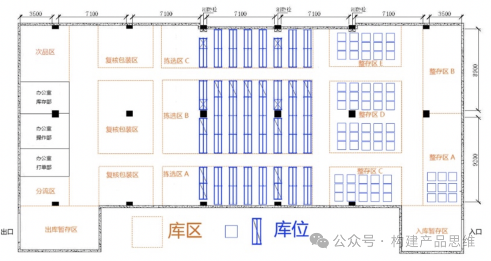

这个是仓库的平面图，但是仓库的基础信息包括商品信息，空间信息，用户信息这三个方面。

a.商品信息主要涉及：商品基本信息，包材。

b.空间信息主要涉及：仓库，库存，货架，货位，容器，设备，月台等。

c.用户信息主要涉及：角色，用户，功能权限，数据权限。

2.空间信息

2.1 仓库

仓库模块的主要用途是对仓库信息进行维护。功能相对比较简单，具体仓库信息如下图所示。

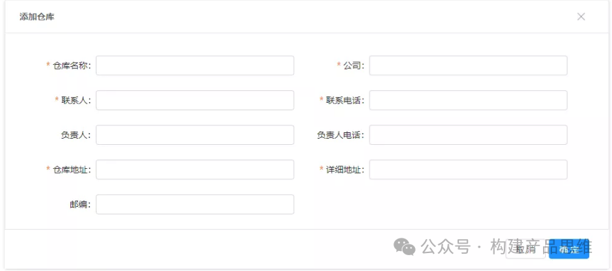

在仓库信息中，最重要的是仓库地址和详细地址。一般是根据这两个地址作为商家发货或者退货的地址。具体的处理逻辑如下所示。

a. 仓库地址一般具体到省市区街道。例如：广东省广州市天河区越秀金融大厦

b. 详细地址：由用户自行填写，填写的内容一般包括具体的楼栋，门牌号。

最后系统会将这两个地址进行拼接。仓库地址+详细地址，商家把这个作为发货或者退货的地址。

2.2 库区

仓库的库区就是对仓库进行区域划分，在不同的区域进行不同的作用，所以库区的信息维护相对仓库来说会更加复杂一些，需要和仓库进行关联，同时库区按照自身属性，也分为不同的类型，库区信息如下图所示。

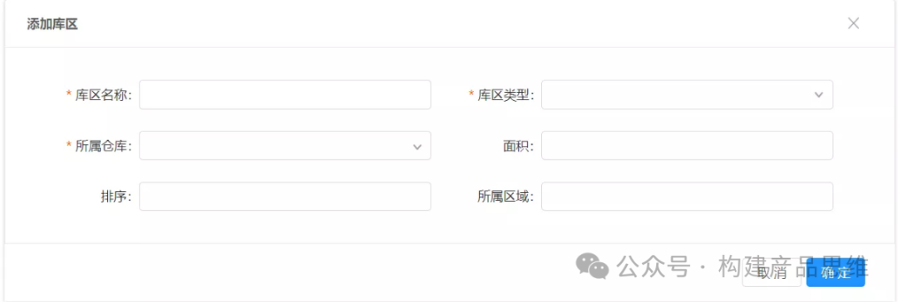

常见的库区类型有：拣货区，暂存区，次品区，备货期，活动区。

成功添加库区的信息之后，不能再编辑库区的类型和所属仓库这两个字段的内容，因为仓库的进销存和这两个信息紧密关联。

根据公司业务可以考虑，是否需要“所属区域”这个字段，有些仓库有二楼，三楼，四楼，可以通过“所属区域”字段进行标准库区所在的楼层，后续在入库任务或者拣货任务时，可以根据该字段进行任务划分。

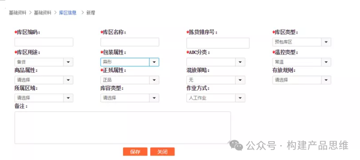

2.3 货架

仓库会在库区中放一些货架来存放产品，不同货架的属性不同，作业也不相同。例如：专门用来拣货的拣货货架，用来存放的暂存货架，整个货架的信息维护如下图所示。

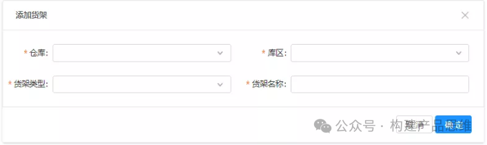

货架类型有中转货架，次品货架，暂存货架，拣货货架等。在仓库中最常见的就是拣货货架。我们以拣货货架为例子，货架的三维图如下图所示。

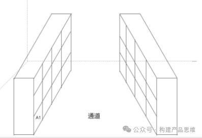

货架还可以和仓库中的巷道进行关联，标记货架所在的巷道，就可以根据巷道，货架，画出库区的平面图，如下图所示。

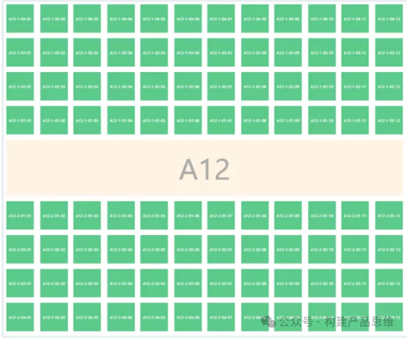

如上所示，一些货架会关联一条巷道，其他货架会关联2条巷道，所以根据货架所在位置标注上和下的巷道。

2.4 货位

货位的基本信息，如下图所示。

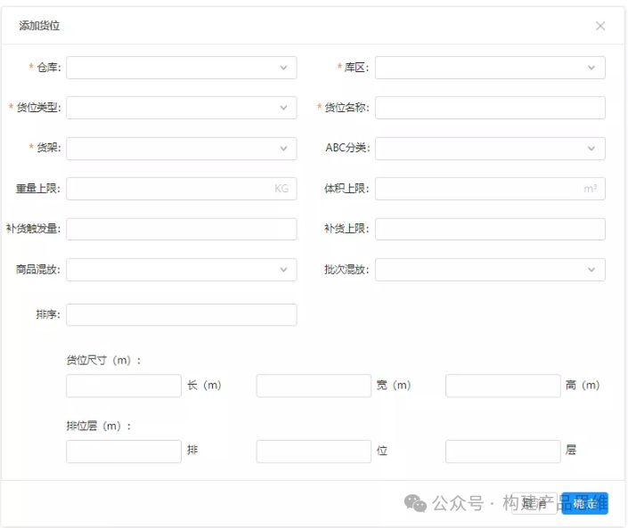

货位的平面图如下所示。

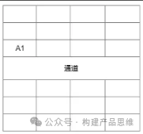

货位的命名在行业内有一定的标准。命名方式为：库区-货架-层-库位，例如：B-1-001-001.在这些基础上命名规则做一些微调。可以将货位所在的巷道加入命名规则中。

2.5 容器

仓库需要对容器进行管控，容器维护的信息如下图所示。

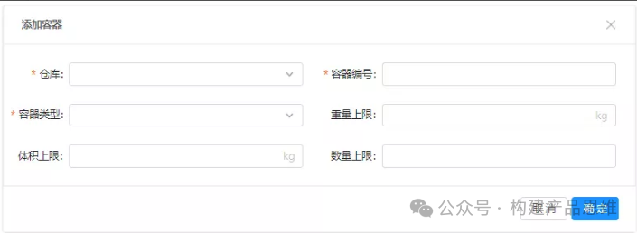

容器类型也有托盘，拣货车，周转箱等。容器的信息维护比较简单，复杂点在于容器的绑定和释放，在收货，拣货，出库时是否需要绑定容器？若绑定了，在什么时候进行释放？以拣货为例子，如果是波次拣货，那么在拣货前需要强制绑定拣货容器，当拣货任务完成之后释放容器。

2.6 月台

月台是每个仓库都会有，一般只有在大型的仓库会对月台进行管理，主要是对月台和车辆进行管理，进行排版调度，月台的信息如下图所示。

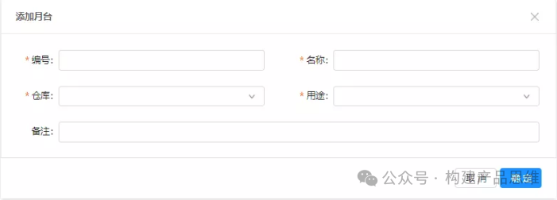

月台主要的用途是用于收货和发货，公司有自己的车辆或者和供应商订单协同很顺畅，可以做一个月台的排班功能，指定什么仓库，什么时间，哪个订单，哪个月台，哪些车辆，进行出入库操作。