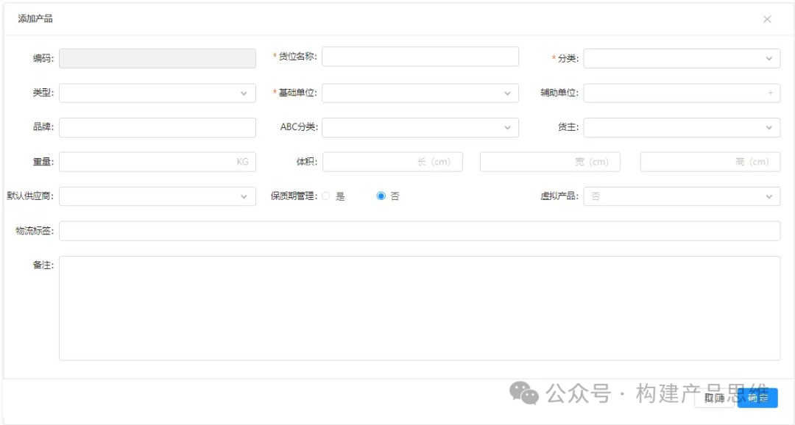
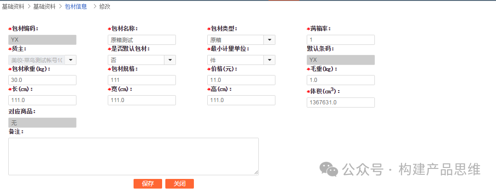

上一篇讲述了WMS系统中的基础信息库存，库位等，这一篇主要讲述WMS基础信息汇总的商品信息和包材信息。不同的商品模块设计，多仓库的产品信息补录，包材的信息维护和简单的使用等方面的内容。

1. 商品信息

在WMS设计商品模块，会根据公司的业务有两种设计模式。第一种是如果公司只有仓库的收发货业务，那么就需要在WMS建立完整的商品档案，也就是商品信息的添加和维护是在仓库进行的。第二种是公司除了收发货，还要有销售端的业务，这种情况商品信息的维护一般是由商品组的人在商品系统中维护，仓库只作为商品信息的补充。

1.1 商品信息在WMS端维护

商品信息的维护如下图所示。

这个是单品的例子，如果添加多属性的产品，就还需要添加属性和属性值。商品信息中的一些字段说明。

a.基础单位和辅助单位

多单位的转换，在零售行业中是比较常见的。例如：12瓶水=1箱，所以12瓶=1箱，比较复杂一点的这种多单位产品的库存管理和出库，在记录多单位产品的库存时，如下图所示。

箱单位向下取整，然后根据用户下单的数量和需求进行箱和瓶出库。比如：上表中的零散库存为4，如果用户下单的数量<=4，不需要拆箱直接散件出库，相反则需要拆箱出库。

还有一种特殊情况，就是如果用户下单的数量=箱库存，这个时候到底是整箱出库，还是优先出库散件库存，然后拆箱，这个是根据业务来决定的。例如：企业之间的采购，都是按照箱进行采购，散件库存只能用于零售。

这是在出库需要考虑是否需要拆零，补货同样需要考虑，如果是存捡分离的仓库，那么在补货时需要根据补货的量，可以找考虑按照箱补货还是散件补货。

b.物流特性

物流特性可以看做产品的物流标签，有一些特殊的产品，在运输的过程中需要特殊手段或者包装：例如：液体，易碎品，粉末，锂电池，航空禁用等。最常见的是锂电池，铅蓄电池等。在国际物流中需要提供MDSD（化学品安全说明书）的相关资料。

2.产品信息补充模式设计描述

如果是在产品信息的补充设计，在WMS中就不需要添加产品信息，产品信息由上游的ERP系统或者产品系统下推到WMS，仓库进行信息的补偿，补充的部分主要包括批次，箱规，重量尺寸等信息。

由上游下推产品信息到，那么产品信息的维护一般由公司的商品部门或销售维护，他们除了维护商品信息，还有商品的报价，销售，供应商等。但是他们不会去维护商品的尺寸，箱规等信息。一般是由仓库拿尺寸和电子秤获取产品的尺寸和重量数据，这个数据在后面计算运费时很关键。

在仓库收货之后，如果这个产品是新品，就必须提示仓库作业人员进行产品信息补充，在补充完成之后，再将产品质检，上架。产品信息补充也可以在质检步骤。产品信息补偿的设计，有三种方案：

a. 多个仓库补录数据，然后提交审核，最后以审核的数据为准。

b.哪个仓库优先补录数据，就以哪个仓库的数据为准。

c.多个仓库补录数据，后者覆盖前者。

3.包材信息

包材其实也是一种商品，可以在商品信息中进行维护，在类型字段中新增“包材”来进行区分，也可以单独进行维护。在大宝WMS就是单独进行信息维护。如下图所示。

包材信息的维护相对而言比较简单，重点是保存的运用，在仓库作业人员作业时，提示作业员，什么产品应该用什么包材。包材主要分为外包材和内容包材。

第一种外包材：这个就是我们常见的网购，商家的包装袋，快递盒之类的。

第二种内容包材：在购买零食，例如：买膨化食品，会在袋子里面看到一小包防腐剂，这个就是内包材，经常网购买零食的朋友们，如果买熟食，例如：卤鸭翅之类的，商家会放一个冰袋。

我们需要将包材和产品相关联，最常见的就是根据尺寸来推荐包材，什么样的尺寸的产品，推荐什么样尺寸的包材，如果一些特殊的产品，就需要推荐相应的内包材。最后一步是打包登记，进行包材的登记，打包时扫描包材的编号，也可以直接使用系统推荐的包材，如下图所示。

4. 总结

除了上篇和这篇介绍的基础信息之外，还有其他的基础信息。比如：员工的工资核算，员工的账号管理，权限管理等信息。由于篇幅有限，在这里就不详细介绍了。