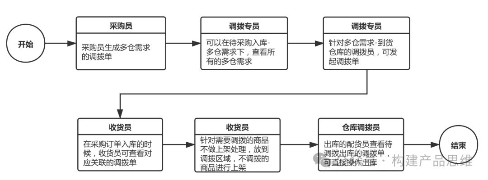
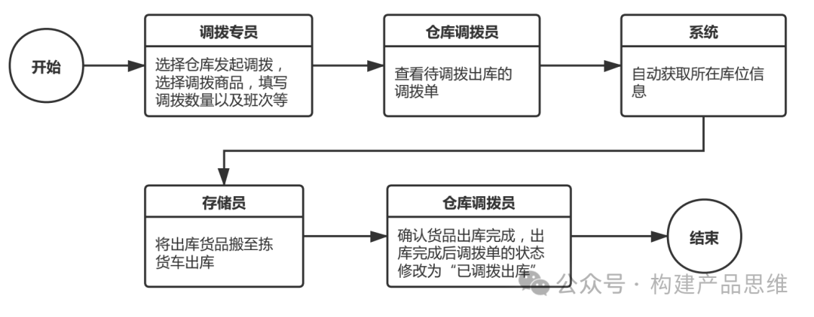
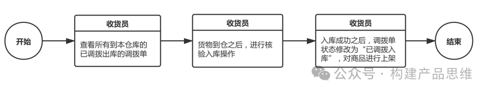
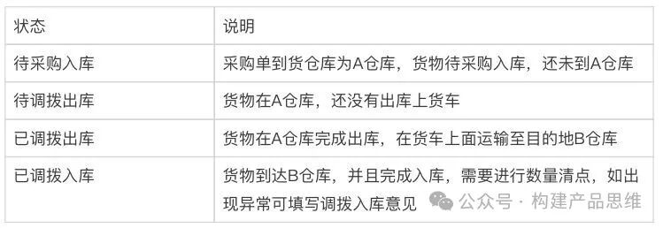
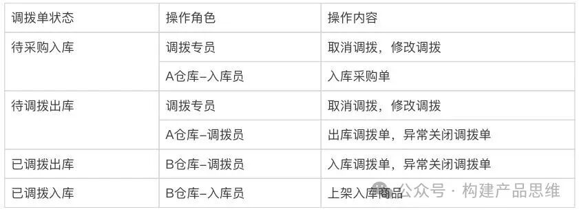

在上一篇中，简要介绍了一下WMS仓管系统的功能模块，在上一篇的基础上，我们将对多仓之间的调拨，实际的业务场景和线上操作来进行简要介绍。让大家对仓库系统有更加全面的了解。

1. 业务流程

所有的出入库，加工盘点等操作，一般都是在一个仓库内来完成，但是在实际线下业务场景中，仓库不断增多的时候，由于仓库的实际面积限制，或者仓库对应的区域销量不同，对仓库的要求也会发生变化。我们会对仓库进行标签区分，划分仓库对应的属性。不同仓库对应的属性，有些仓库作为总仓库存储备用的功能，有些仓库作为加工仓库功能，有些仓库作为发货的功能等等。一般的多仓调拨，主要分为三个阶段。

第一阶段：调拨员先创建调拨单

第二阶段： 依据每日调拨班次调出仓库，出库由调拨员来操作。

第三阶段：当调入商品到仓库时，入库由调拨员来操作，核准入库数量同时入库。

2.基础功能

2.1 基础信息

在原有仓库的基础上，区分仓库为：分仓和总仓。分仓负责调入商品，总仓负责调出商品。

2.2  班次管理

在仓库调拨之前，班次用来作为一个规范，是针对总仓的。一天有多个时段，用来调拨出库至对应的仓库。好像班车发车的规则，设置时间点，从某个始发站到达某个终点站。

班车设置：设置班次的发车时间，调出仓库，调入仓库，和对应的班次的司机信息。

班次查询：查看每天对应的班次，需要调拨出库的作用和班次系的调拨单状态，是否出库，出库状态是否延期或者正常等。方便仓库操作人员对当天工作及时处理。

2.3 入库管理

a. 待采购入库

采购人员在创建采购单时，选择采购单的属性是多仓需求，还是单仓需求。如果是多仓需求，就是采购单入库的商品。也是需要分别调拨到其他的仓库。

调拨专员，可以查看所有待采购入库的数据，并且选择采购单生产调拨单，此时对应生产调拨单的状态为"待采购入库”。

采购调拨出库流程如下图所示。

b. 已采购入库数据

针对所有已采购入库数据，也可以发起调拨单，对应生成的调拨单状态为“待调拨出库”。针对已经采购入库的采购单生产调拨单，需要注意的是：

对应创建的调拨单，不根据采购数量，而是根据当前仓库商品的实际库存数量。存货调拨出库流程如下图所示。

c. 已调拨入库数据

数据同步调拨单的入库操作。在创建调拨单并调拨单成功之后，自动生成已调拨入库的数据，在PAD或其他移动终端，可以针对入库的调拨单进行上架操作。调拨入库流程如下图所示。

2.4 出库管理

调拨出库的数据，这些数据同步调拨单的出库操作，在创建调拨单并且同时调拨单成功出库之后，接下来自动生成调拨出库的数据，可以查看历史出库信息，出库的操作人员和出库的库位等。

2.5 调拨管理

a.调拨单状态描述

调拨单总共有四种状态。例如：A仓库调拨到B仓库，状态说明如下。

b.调拨角色描述

调拨单的操作主要有两种角色。

调拨员：每个仓库都有对应的调拨员。主要的职责是调拨单的实施，总仓的调拨员按照每日的班次安排进行调拨出库，分仓的调拨员就是进行入库操作。

调拨专员：负责多个仓库，在组织架构中，可查看并且操作多个仓库数据。主要负责仓库的库存监控，操作调拨单。

c.调拨操作描述

