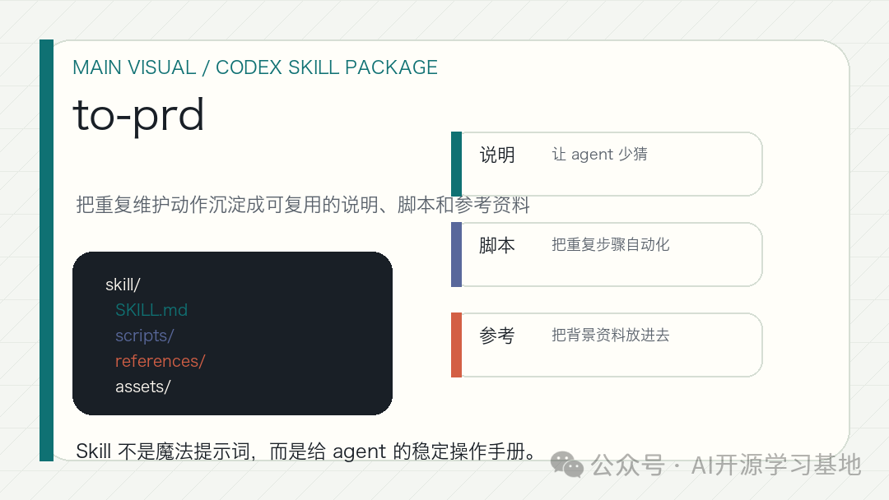
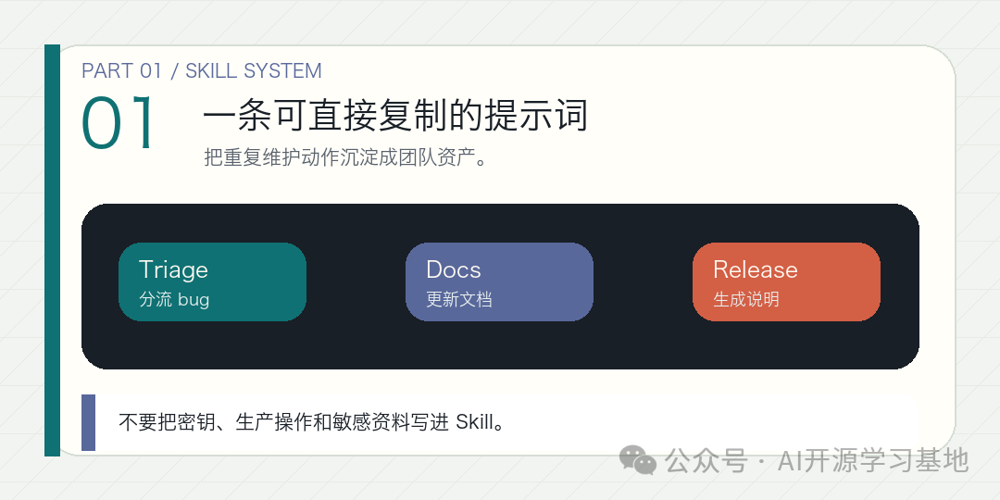
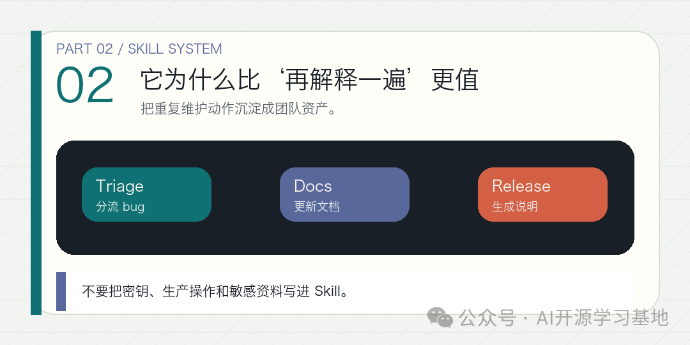
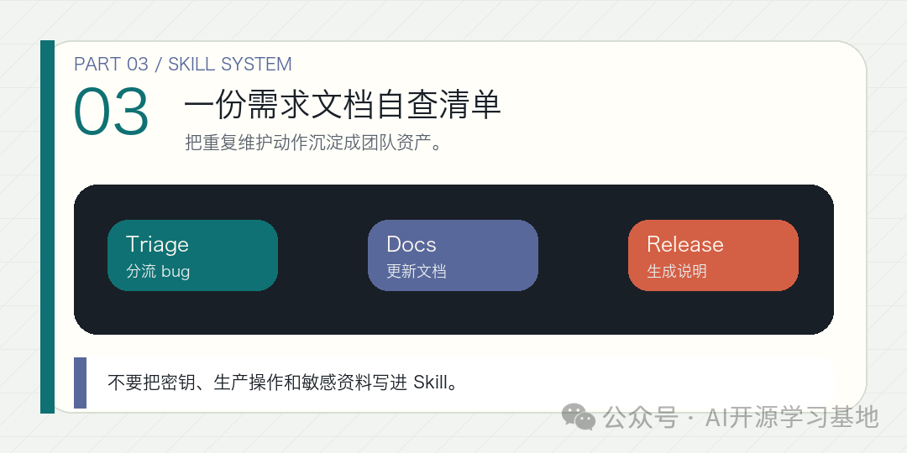

AI 普惠日更 / Research Note

# to-prd：把聊天记录整理成需求文档

`to-prd` 值得进前十，因为它不是让你再开一轮访谈，而是要求 agent 基于当前上下文和代码库理解，直接把已经讨论清楚的内容收束成一份能进入 issue tracker 的需求文档。

很多团队和 AI 协作，会卡在一个很熟悉的阶段：

已经聊了很多。

方向也差不多定了。

但真正要进入执行时，大家还是缺一份正式文档。

于是下一步又变成：“你把刚才那些整理成一个正式需求文档吧。”

听起来合理，实际常常很低效。因为 agent 又会重新问一遍已经讲过的问题，或者把聊天里已经定下来的边界重新模糊化。

`to-prd` 这个 skill 最值钱的地方，就是它明确要求：**不要重新采访用户。**

它要做的，是把当前对话上下文和代码库理解，压成一份结构化需求文档。

这很像把“对话阶段”正式切换成“执行阶段”。

为什么这件事重要？

因为很多需求并不是没想清楚，而是没被收束。

你已经讨论了问题、想法、一些技术边界，甚至提到该测什么了，只是这些东西还散在聊天里，没法直接给下一位工程师或 agent。

`to-prd` skill 刚好补上这个动作。

它的模板也很实在：

* 问题陈述
* 解决方案
* 用户故事
* 实现决策
* 测试决策
* 超出范围
* 补充说明

其中我最喜欢的，是它把测试接缝放得很靠前。

这意味着需求文档不是纯产品文档，而是一个同时考虑了“怎么验证”的执行文档。

换句话说，它不是只写“要做什么”，还要开始约束“怎样算做好了”。

这对 AI agent 很重要。

因为 agent 最容易在目标不够结构化时，一边写方案一边发明实现路线。需求文档一旦成型，它至少有一个更稳定的边界，不会一会儿往产品讨论漂，一会儿往代码细节漂。

今天如果你想试，一个很稳的用法是：

先围绕需求讨论一轮，确定目标、受影响对象、边界和大致方案。然后说：

“不要再问我新问题了。基于当前上下文和代码库理解，整理成需求文档。先看现有实现，再写问题、方案、用户故事、测试决策和超出范围部分。”

这样得到的需求文档，通常比“让 AI 从零写一篇需求文档”更有价值。

因为它承接的是已经发生过的判断，而不是凭空生成格式正确的废话。

所以，`to-prd` 这个 skill 真正适合的场景，不是灵感发散期，而是收口期。

它的作用不是启发你，而是帮你把已经想清楚的东西，沉淀成团队可以接手的正式入口。

主图：把任务说明、工具执行、来源检查和人工确认串成一条可控工作流。

## 一条可直接复制的提示词

章节图：这一节用一张图帮助读者快速抓住结构。

可以直接这样用：

“不要重新采访我。目标是把当前讨论整理成需求文档。输入包括当前线程、代码现状、来源、相关 issue、PR、diff 和测试线索。输出按需求文档模板写问题、方案、用户故事、实现决策、测试决策和超出范围。边界是不要凭空发明需求，确认点写清。”

这类提示词最适合已经聊到七八分清楚的时候。

## 它为什么比‘再解释一遍’更值

章节图：这一节用一张图帮助读者快速抓住结构。

因为你一旦让 agent 重新问，很多已经确定的边界会被重新变松。

而 `to-prd` 的价值，就是把已有目标、输入、输出、边界和确认点固定下来，再补上代码、测试、review 和实现层面的可执行表达。

这对 GitHub issue、PR 和后续 agent 接力都很关键。

## 一份需求文档自查清单

章节图：这一节用一张图帮助读者快速抓住结构。

写完后可以快速看：

1目标是否明确

2输入是否有来源

3输出是否可执行

4边界是否写清

5确认点是否留给正确的人

6测试怎么落

7代码和 review 要看哪里

8哪些内容明确超出范围

这 8 项越清楚，需求文档越像工作入口，而不是长一点的会议纪要。

放到 AI 工作流里看，需求文档的作用不是增加文档数量，而是让行动、边界、来源和确认点在真正写代码前就被固定下来。

真正能落地的需求文档，最后都应该回到下一步行动：谁来接、先看哪些输入、要产出什么输出、哪些边界不能越过、哪些确认点必须人工拍板。把这些写进正文，后面的 issue、测试、代码 review 和交接才不会重新发散。

如果连这一步都没有，文档就只是解释，不是真正的执行入口。对团队来说，需求文档的价值从来不只是把话写整齐，而是把后续行动顺序和验证方式一起固定下来。

来源

GitHub：mattpocock/skills `skills/engineering/to-prd/SKILL.md`  
https://github.com/mattpocock/skills/tree/main/skills/engineering/to-prd

GitHub Raw：`to-prd` skill 原文  
https://raw.githubusercontent.com/mattpocock/skills/main/skills/engineering/to-prd/SKILL.md