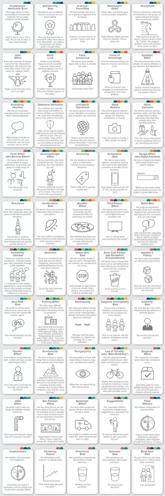
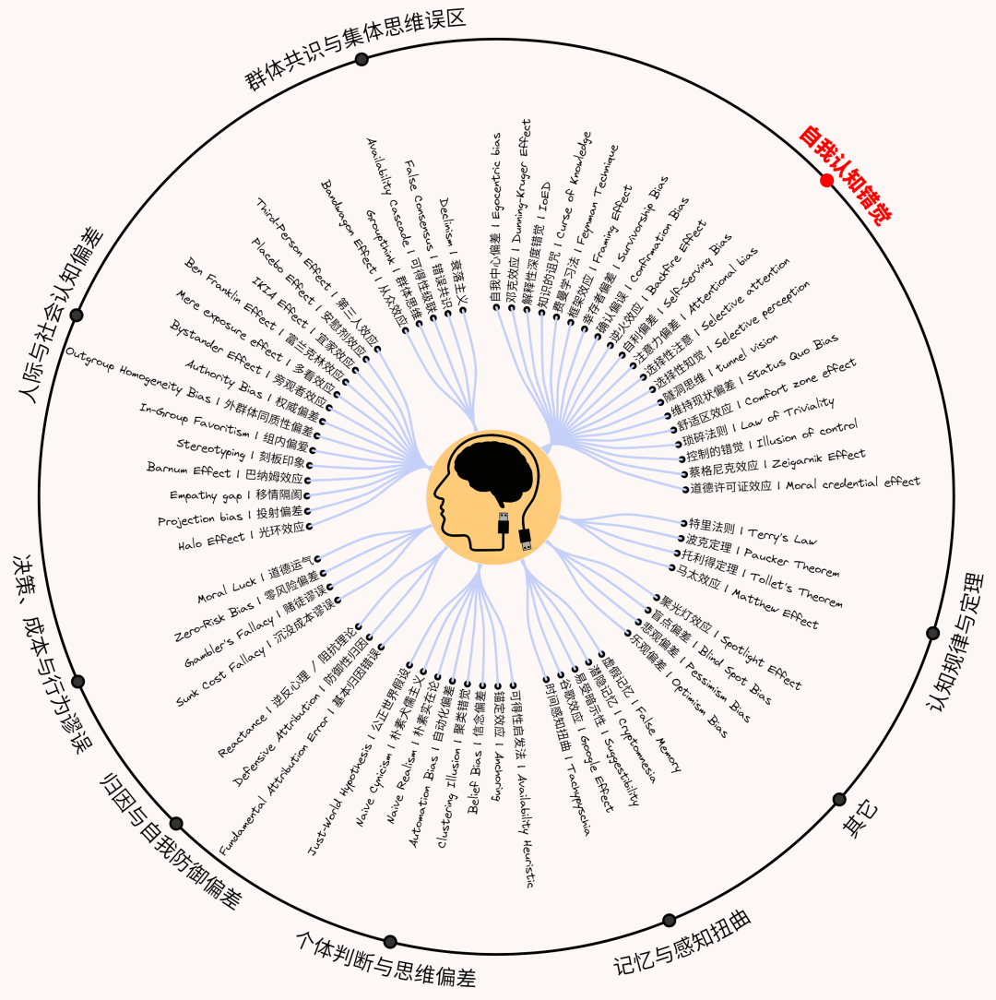

感谢大家对上一篇文章（[世界史](https://mp.weixin.qq.com/s?__biz=MzI2ODY0OTA4NQ==&mid=2247486604&idx=1&sn=3ccd27df8088053153f3717a9209a59a&scene=21#wechat_redirect)）的点赞与转发。本文系统梳理一下那些极其深刻而且相当实用的重要认知偏差或心理学效应。

之前已经制作过一张认知偏差的图（[底层认知偏差](https://mp.weixin.qq.com/s?__biz=MzI2ODY0OTA4NQ==&mid=2247486485&idx=1&sn=ed415f065835ceaf6940e8fab9aa8709&scene=21#wechat_redirect)），那张图只挑选了少数最重要的认知偏差，按照一条完整的从底层认知到高效实践的逻辑主线而制作，相对简略。本文分享的这张大图，基本的逻辑主线不变，但内容更全面，几乎涵盖了我当前想到的所有重要认知偏差或心理学效应以及重要的跨学科关联理论。

几年前，马斯克分享过“50个认知偏差”长图，并特别标注“Should be taught to all at a young age”，之后，这张图在全球各大平台疯传。我很认同他的这条标注，确实是——所有人都应该尽早知道这些认知偏差。它们不是鸡汤式语录，而是真的可以重塑一个人的底层认知及实践习惯。

本文分享的大图，完整涵盖了上述50个偏差，倒不是刻意朝那个清单靠近，而是在系统浏览了搜集到的200多个认知偏差后，挑出了六七十个相对重要的，50个偏差基本都在里面了。那个清单的原创作者，显然也是经过一番精挑细选的。

50个偏差中，涵盖了很多我认为最重要的底层认知偏差：邓宁-克鲁格效应（Dunning-Kruger Effect）、知识的诅咒（Curse of Knowledge）、维持现状偏差（Status Quo Bias）、自利偏差（Self-Serving Bias）、确认偏误（Confirmation Bias）、虚假记忆（False Memory）、幸存者偏差（Survivorship Bias）、框架效应（Framing Effect）。但它也遗漏了一些超级重要的底层偏差，最典型的例如：解释性深度错觉（illusion of explanatory depth ，简称IoED，自我反思及指导高效实践的最底层的核心偏差）、自我中心偏差（Egocentric bias，绝大多数偏差的底层思想根源，因此放在了大图的首位）、道德许可证效应（Moral credential effect，对我而言至关重要的一个底层偏差，我所有拖延行为的核心症结所在，以后做“自控力”的大图时会重点谈到这个概念）。这些概念很深刻、很重要，其中一些，以后可能会单独制作大图。

50个偏差清单中，大部分都是“认知偏差”，另外一部分并不是严格意义上的“偏差”，而应该算是心理学效应或定律，例如“安慰剂效应”。本文这张大图中，特地加了一些特别重要心理学效应，例如：特里法则（Terry's Law）、波克定理（Paucker Theorem）、托利得定理（Tollet's Theorem）、马太效应（Matthew Effect）。

这张圆环图（目录，顺时针顺序，和大图的上下顺序一致）中，总共有67个条目，其中66个都属于认知偏差或心理学效应，只有一个例外：费曼学习法，它是一种实践方法，而且是极其高效的实践方法。通过邓克效应、知识的诅咒和解释性深度错觉等底层偏差，可以非常充分地衍生出“费曼学习法”这个精准高效的实践方案，这个概念太重要，所以专门加进目录图中，在大图中，也专门将“费曼学习法”放在左侧认知主线上（在“解释性深度错觉”和“知识的诅咒”之间）。这张图中，最重要的是加粗标红的“自我认知错觉”大类，上面提到的重要概念几乎都放在这个大类中。

所有的跨学科关联理论，都放在大图的右侧。如前所述，它几乎涵盖了我当前所能想到的所有重要的跨学科关联理论，例如：图式、建构主义、议程设置、知行合一、固定型思维（成长型思维）、认知惰性、知识茧房、路径依赖、外延认知……

全图约2.2万字，左侧一共有66个认知偏差/心理学效应，右侧一共有100个多学科跨领域关联理论（“费曼学习法”是例外，放在左侧）。

下面这个视频，快速展示了完整成果图，可以花一分钟速览全图。

已关注

关注

重播    分享     赞

关闭

**观看更多**

更多

*退出全屏*

*切换到竖屏全屏**退出全屏*

cas01已关注

分享视频

，时长01:00

0/0

00:00/01:00

切换到横屏模式

继续播放

进度条，百分之0

[播放](javascript:;)

00:00

/

01:00

01:00

[倍速](javascript:;)

*全屏*

倍速播放中

[0.5倍](javascript:;)  [0.75倍](javascript:;)  [1.0倍](javascript:;)  [1.5倍](javascript:;)  [2.0倍](javascript:;)

[超清](javascript:;)  [流畅](javascript:;)

继续观看

一张大图，详览66个认知偏差/心理学效应，和100个多学科跨领域关联理论，构建底层认知和高效实践体系

观看更多

原创

,

一张大图，详览66个认知偏差/心理学效应，和100个多学科跨领域关联理论，构建底层认知和高效实践体系

cas01已关注

分享点赞在看

已同步到看一看[写下你的评论](javascript:;)

 

[视频详情](javascript:;)

若觉得此图对你有所帮助，可通过以下方式自行获取完整的高清成果图：在公众号 “**cas01**” 主界面对话框中回复“**偏差**”（请前往“**cas01**” 的主界面进行回复，在评论区回复关键词是无法触发自动回复的），即可获取已分享的同类主题的所有最新版成果图。

往期文章：

[一张大图，用全球4大州11大文明时间线并行的视角，速览世界历史古典社会1000年：从波斯、大汉、罗马帝国到丝绸之路](https://mp.weixin.qq.com/s?__biz=MzI2ODY0OTA4NQ==&mid=2247486604&idx=1&sn=3ccd27df8088053153f3717a9209a59a&scene=21#wechat_redirect)

[一张大图，详览芯片史 ：从量子物理到能带理论，从真空管到晶体管，再到集成电路与芯片](https://mp.weixin.qq.com/s?__biz=MzI2ODY0OTA4NQ==&mid=2247486594&idx=1&sn=a87d4968807e06d4855cfa279f54ca60&scene=21#wechat_redirect)

[一张大图，详览心理学史上的重要里程碑：从需求层次到心流再到积极心理学，从裂脑研究到大脑计划](https://mp.weixin.qq.com/s?__biz=MzI2ODY0OTA4NQ==&mid=2247486585&idx=1&sn=46691fc8ba14dc2120e43f170b7e44ff&scene=21#wechat_redirect)

[一张大图，用全球四大洲10大文明时间线并行的视角，速览3000年世界历史古代史](https://mp.weixin.qq.com/s?__biz=MzI2ODY0OTA4NQ==&mid=2247486562&idx=1&sn=f33c78799e76b0e3960931ae2fb2ed6c&scene=21#wechat_redirect)

[一张大图，详览PPT幻灯片演讲圣经：全是底层基础理论和心法，附83张精致配图，含6大类22小类共246种图示模型](https://mp.weixin.qq.com/s?__biz=MzI2ODY0OTA4NQ==&mid=2247486551&idx=1&sn=6a9c254688724c5f681ce362878486a9&scene=21#wechat_redirect)

[一张大图，遍览194个论证谬误和70多个跨学科关联理论：从“事后画靶”到“非黑即白”，从“共享预设”、“主体间性”到“认知共识”](https://mp.weixin.qq.com/s?__biz=MzI2ODY0OTA4NQ==&mid=2247486538&idx=1&sn=76f556443bdbd9bc961b1891e6116231&scene=21#wechat_redirect)

[一张大图，全面系统地建立批判性思考知识框架：从底层概念到应用实践，从17种证据类型到5大类近60个常见论证谬误](https://mp.weixin.qq.com/s?__biz=MzI2ODY0OTA4NQ==&mid=2247486504&idx=1&sn=d0fb12014dcfc49a29d3f0f4691f58bf&scene=21#wechat_redirect)

[一张大图，详览2600年中国哲学史，含98位哲学家的关键思想及时间线脉络，附成果图分享](https://mp.weixin.qq.com/s?__biz=MzI2ODY0OTA4NQ==&mid=2247486495&idx=1&sn=7120e2c857965f5a5e20f31d859a4f96&scene=21#wechat_redirect)

[一张大图，从底层认知角度构建完整的成长路径：基于22个基础认知偏差，和40个跨领域关联理论](https://mp.weixin.qq.com/s?__biz=MzI2ODY0OTA4NQ==&mid=2247486485&idx=1&sn=ed415f065835ceaf6940e8fab9aa8709&scene=21#wechat_redirect)

[一张大图，全览当代西方哲学318位分析哲学家的重要思想及脉络](https://mp.weixin.qq.com/s?__biz=MzI2ODY0OTA4NQ==&mid=2247486449&idx=1&sn=d9e5893db54554c4960785a8a96a565c&scene=21#wechat_redirect)

[一张图看完现代西方哲学的85位哲学家，跨学科思维在哲学与AI间的奇妙碰撞](https://mp.weixin.qq.com/s?__biz=MzI2ODY0OTA4NQ==&mid=2247486416&idx=1&sn=62d8c686d67a51e933f96d379fa90a35&scene=21#wechat_redirect)

[一幅图看完137位哲学家的关键思想：西方哲学史全解析](https://mp.weixin.qq.com/s?__biz=MzI2ODY0OTA4NQ==&mid=2247486404&idx=1&sn=024d9ceee4befd2c3935c7e12b1bff6d&scene=21#wechat_redirect)

[一张可视化大图，看完认知心理学的重要知识点](https://mp.weixin.qq.com/s?__biz=MzI2ODY0OTA4NQ==&mid=2247486394&idx=1&sn=9a77128fd30ff81098acf960ee5ecfeb&scene=21#wechat_redirect)