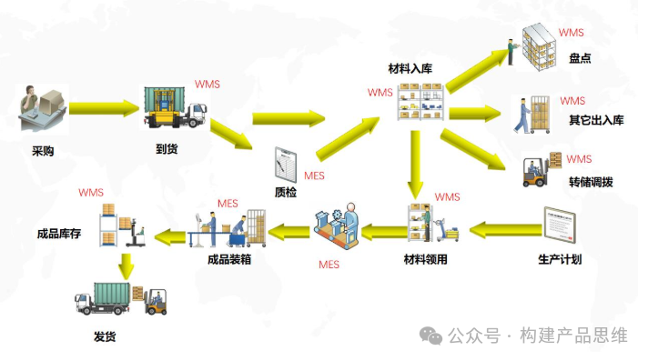

在如今快节奏的发展和信息化浪潮中，仓库管理系统（WMS）已经为优化库存管理的关键工具和提升企业运营效率的关键方式。怎么成功实施WMS系统呢？下面将简要介绍WMS系统实施的步骤和过程。

1.项目准备阶段

a. 确定切换计划

多与区域运营和仓库运营等多方进行沟通明确仓库切换计划，如果仓库有多个货主时，需要确定货主切换计划。

b. 明确目标仓库

明确要切换的货主，同时也要明确切换仓库。

2.需求调研阶段

2.1 需求调研

可以先和需求方沟通仓库大致情况，接下来去仓库现场进行实际的调研，调研主要包括以下几个方面。

a.仓库情况：

库区情况，库位分布，仓库使用面积，工作区情况，工作站情况，仓库容器情况，仓库总单量，促销高峰单量，仓库人员，仓库角色等。

b. 商品情况：

每个货主下面的商品信息，序列号股灾，是否序列号管理，是否虚拟号，商品批次属性，是否有效期管理，有无组合品，商品包装情况，有无赠品，有无预包，有无组件/子件等。

c.系统情况

仓库现有使用的WMS系统，系统数据流转，接口情况，库存对账，上下游系统如（OMS/ERP/TMS/BMS）,库存对账等。

d.货主情况

货主数量，业务类型（TOB/ToC）,货主单量，所属行业。

e.库存管理

补货，盘点，移库，批次属性调整，库存冻结/解冻的流程，涉及到打印模版以及有无库内特殊流程，如加工，保养，翻堆倒垛，货权转移等

f. 入库情况

入库总流程，收货流程（采购收货/调拨收货/退货收货等）,上架规则，上架流程，打印单据模版。

g.出库情况

出库总流程，拣货流程，组波流程，复核流程，集货流程，播种流程，打印单据模版，波次规则，增值服务情况等。

h.设备管理

称重设备，视频监控设备，打印设备等。

i.报表管理

入库报表，出库报表，进销存报表，库内报表，效期报表，序列好报表，数据大屏，个性化报表等。

j.性能关注

根据高峰单量关注各个节点性能情况

k.特殊场景

根据每个客户的实际场景看是否有无特殊场景

l.异常处理

退货入库，拒收，出库单取消等异常流程处理方式。

2.2 系统演示

WMS系统，操作体验，操作步骤有无需要更新等情况

2.3 仓库体验

给仓库开通测试账号，方便仓库人员体验。

2.4 环境情况

网络设备（内网，外网等），服务器，登录有无特殊要求。

3. 需求上线阶段

3.1 细化项目里程牌

需求评审时间，开发完成时间，产品验收时间，用户验收时间，切换时间。

3.2 产品设计到需求上线

仓库需求设计，仓库需求评审，需求开发，功能测试，产品验收，操作手册输出。

3.3 产品验收阶段需要注意

一般需求将仓库数据直接拿过来进行验收，非常容易出问题，很难规避风险。

4. 用户培训与现场实施

这个时候，就需要到仓库现场出差实施，主要的步骤如下。

4.1 数据准备

仓库信息，商品数据，货主信息，规则类，库位数据，单据模版，系统参数类，角色和账号以及其他数据等。

4.2 用户培训

日程作业流程，现场培训，设备使用等等。

4.3 用户验收

给仓库运营留出一定时间验收，建议直接在生产环境验收，方便发现紧急问题，规避线上风险。

4.4 上线计划

明确各货主或者货主下某个业务的具体上线日期，数据迁移，上下游系统订单关闭和开启。

4.5 第二波数据准备

清除测试数据，检查第一波数据情况。比如是否有更新商品，是否有库位变动。

4.6 历史单据处理

当旧WMS系统单据处理完毕或归档，或者需要推送到新的WMS，

4.7 上游系统推单关闭

关闭上游系统入库单，出库单以及其他单据推单按钮，注意，建议在上下游系统对账钱前完成。

4.8 期初库存导入

将旧WMS系统的期末库存作为新WMS的期初库存导入并核对无误，注意六号库存备份。

4.9 上游系统推单开启

建议跟仓库运营沟通可留下几个单作为验证，推单开启后，从上游系统推送。

4.10 真实数据验证

根据真实单据，进行流程验证，验证通过后，上线完成，注意上线完成一半要记得发上线邮件，确保通知到各个部门。

4.11 运营跟进

一般切换系统通常在凌晨左右，在接下来的几天非常重要，要轮班驻场跟进运营情况，同时收集紧急需求，保证需求及时上线确保用户体验。

5.需求迭代和运营

5.1 需求迭代

整理归纳所有的需求，然后分析需求的优先级，同时关注需要立即上线的需求，给出最小解决方案，保证仓库运营。

5.2 运营跟进

关注运营的情况，做到及时反馈。如果经过一周左右的时间运营稳定之后，就可以采取日常运营的方式。