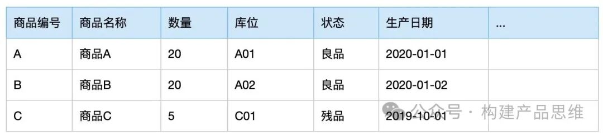
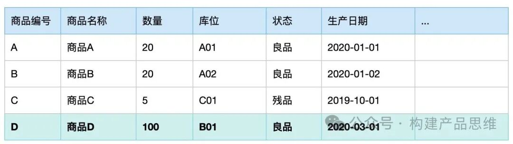
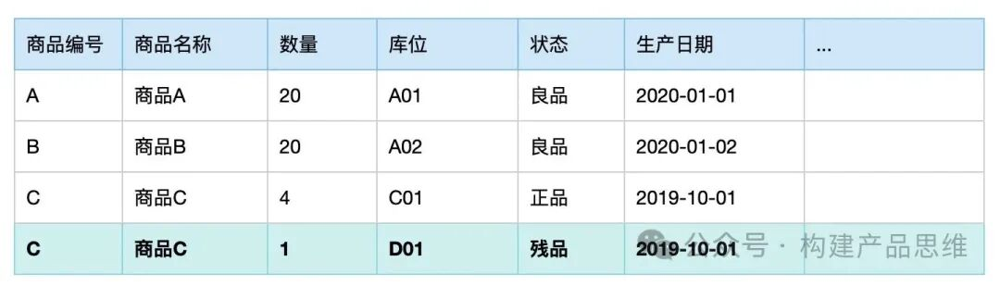
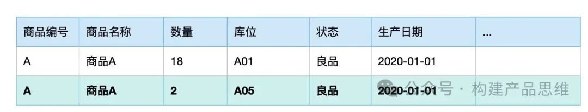

库存管理是仓库管理最关键的部分，通过了解库存表的基本结构，库存表的变化情况，可以让大家更好地了解仓储管理。

1.库存表

下面是一张简单的库存表，某个仓库里面有商品A，商品B，商品C三种类型的商品。各有不同的数量，放在不同的库位上，A和B为良品，商品C为残次品。库存表如下图所示。

这张库存表包括了库存的一些基本信息，通过这张库存表，我们可以知道仓库内现有商品的剩余数量，商品放在仓库那个位置，商品是好的，还是坏的，商品的数量，商品的生产日期等。仓库对在库商品进行管理，管理商品的数量，状态，位置等这些重要信息。

接下来我们结合实际情况，看一下库存表数量，状态，位置等什么时候发生变化，以及怎么变化的情况。

1.1 数量变化

商品的库存数量什么时候发生变化。通常是这三种情况。第一种是商品出库会减少库存数量，第二种是商品破损，丢失，在做盘点库存调整时，也会改变库存数量。第三种情况是商品入库时会增加库存数量。下面我们来看一下这些变化。

a.出库会减少库存：商品出库会减少库存，假设库位上的商品全部出库，这个时候会把库位库存数调整为0。如果是一部分出库，就会减去部分数量。

b.入库增加数量：商品从工厂生产号之后，达到仓库了，收货员会进行清点同时要检查商品质量，接下来就把商品上架到某个库位上，这个时候就会增加当前库位的库存。如上，商品D入库后上架， 库存表中多了一条记录，库位为“B01”， 数量为“100”， 状态为“良品”， 生产日期为“2020-03-01”。

1.2 状态变化

在什么时候修改库存的状态呢？在商品将要入库的时候，一般会做入库质检，将商品定为"残品”或者“良品”，在库存表中，可以通过“状态”列表来了解当前库存的情况。在日常的库存管理中，也会修改调整库存的状态，例如:包装破损，变质，变形等。通常会依据实际情况，修改对应库存记录的状态。

1.3 位置变化

存放在仓库里面的商品，是通过“库位”来确定商品的位置，大型仓库通常会分为好几个区域：整箱存储区，卸货区，散件拣选区等。在区域的下面通常会再设置货位，通过通道，拣货组，层来定位商品的具体位置。比如：货位编号“A01-02-07”代表在A区01通道的第2层第7个位置，入库后商品放到具体货位，有订单需要出库时，再从对应的货位找到商品，打包出库。

一般仓库内调整商品库位大多数都是借助PDA来完成。比如：商品A从原来的货位移动到新货位，我们只要扫描货位，并扫描商品，再扫描新货位就可以完成，告诉计算机要移动什么位置的商品到什么位置，系统自动完成库存表的操作。

上图中，原来的A01上有商品30件，从A01货位移动了2件商品到A05货位，A01货位上的商品数量就变成28件，另外2放在A05上面。

2. 总结

通过库存表数量，状态，位置的变化，我们来对商品的库存进行管理，库存管理是仓储管理的关键部分，通过了解库存表的基本结构，库存表的变化，我们可以更好地了解仓储管理。