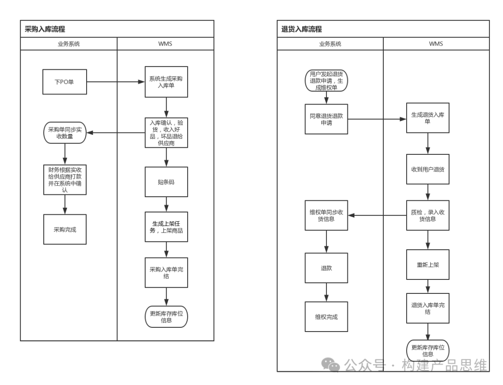
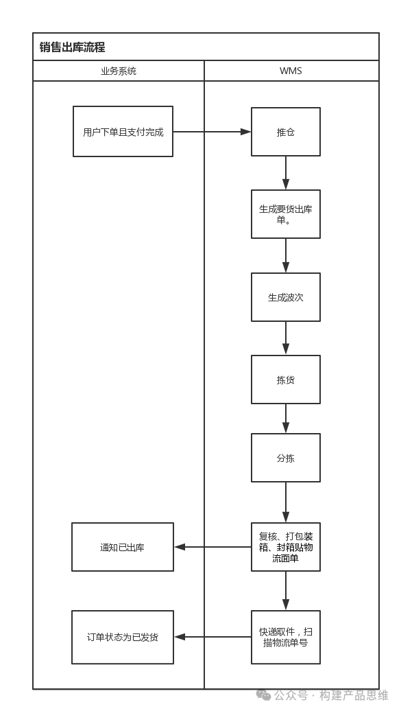

在仓储管理系统中，其中采购入库，退货入库和销售出库是出入库流程中最核心的业务模块。下面简要介绍介绍这几个功能模块。

1.采购入库业务流

1.1 采购开单

采购系统在开单之后，如果审批通过之后，接下来就同步至WMS生成对应的采购入库单。相关的采购人员就将采购清单导出发给对应的供应商。

1.2 验货

相关的供应商依据采购清单来发货，货物到仓库之后，仓储收货员依据采购单的编号在WMS中查找对应的入库单。在保证有这笔采购记录之后，接下来就开始验货。如果货品数量多的时候，一般会采用抽检的方式。

1.3 入库

在完成验货之后，在系统中录入实收的数量，当前入库单状态转变为“已收货”。在实际场景中，会出现供应商无法一次性交货的情况，需要系统支持同一个采购单对应多次入库的任务。如果实收数量小于应收情况时，会将剩余没有入库的商品清单生成一张新的入库单等待下一次收货。如果有保质期的商品，需要按照生产日期不同，分多条数据的方式录入，系统根据到期日期生成批次号。没有保质期的商品依据入库日期生成批次号。比如商品a1送了70件，10月6号到期的有20件、7号的有20件、8号的有30件，那么系统中会记录该商品实物库存70件，分别是1006批次20件放在1库位、1007批次20件放在2库位、1008批次30件放在3库位。有了批次库存的管理方便定义后期出库的规则，比如按照先到期先出或者先进先出，前面的例子在出库时系统计算会优先取1库位上的商品。

1.4 采购结算

采购单对应的全部入库单都变为已收货。同时将结果推送到业务系统。采购单流转到财务结算节点，等财务在系统中确认付款完成之后，这笔采购单状态变为“已完成”。

1.5 商品贴码

在系统中商品的唯一标识是SKU码，将SKU码打印，并贴到商品上，便捷以后扫描商品系统可以识别。

1.6 上架

一张入库单中都包括多个SKU，上架是SKU维度的操作。一张入库单对应有多个上架任务。上架员领取任务后，依据系统推荐的库位或者自行选择库位上架，扫描库位码和商品码，确认上架入量，同时更新库位库存。入库单中的商品全部上架完成之后，入库单状态变为“已完成”。

2.退货入库业务流

2.1 申请维权

当C端用户发起维权，申请退货退款时。当平台同意申请之后，WMS就会生成一张退货入库单和维权单。这个时候用户将货物寄回，在C端填写物流信息，物流单号就会同步到WMS系统中。

2.2 验货

当仓库收到货之后，会依据内部的验货规则，来决定货物是否达到可退标准。如果商品没有严重损坏都会收，如果没有达到退货标准，则会拒收。

2.3 入库

扫描或输入物流单号查询对应的退货入库单，将拒收数量，收入数量录入到系统中，退货入库单状态变为“已收货”，同时将收货信息同步到业务系统。

2.4 退款

客服人员会依据收货情况和用户进行沟通，这时候维权单状态为退款成功。

2.5 上架

退回的货物会根据规则统一放置在退货区，接下来定期由质检人员统一上架。扫描物流单号可以查询对应的退货入库单和上架任务。如果是完好的，可以二次售卖的商品上架员一般会根据系统推荐的原库位进行上架。如果商品有明细的损坏，例如：小零件需要修理或者外包装坏了，这个时候就会将商品上架到坏品区。后面会处理这些问题。上架之后就要同步更新库位的库存。退货入库单中的商品全部上架完成之后，状态变为已完成。

3.销售出库业务流

3.1 推仓

在用户下单和支付完成之后，这个时候为用户分配对应的物流单号。如果是和第三方物流公司合作的，一般会预留一部分物流号段。将订单推送到WMS生成出库单，包括用户收货信息，SKU信息，物流性。同时出库单会按照出库规则锁定库位库存。

3.2 生成波次

就是将几个出库单合并生成波次单，然后依据波次单拣货，以此来提高拣货效率。最好设定规则系统自动生成波次。

3.3 拣货

拣货员领取拣货任务，波次选择容器（拖车，拣货框等）扫描容器编号，绑定容器和波次单，波次单状态变为“拣货中”。拣货员依据手持设备商的推荐路线和库位拿取对应的商品，扫描库位和商品条码，确认拣货数量，同时更新库位库存。

3.4 分拣和打单

分拣就是按照波次拣的商品根据出库单分开。打单就是这次波次管理的出库单，物流面单打印出来。确认开始分拣，波次单状态变为“分拣中”。扫描出库单和分拣框，每个出库单绑定一个分拣框，出库单和物流面单放在分拣框中。依次扫描拣货框的商品，按照系统的指引放在对应的分拣框中。

3.5 复核和打包和发货

在分拣完成之后，接下来就将各个分拣框送到复核区，复核人员主要是核对分拣框中的出库单，实物商品，物流面单三者是否一致。复核完成之后，将实物商品和出口单打包装箱并封装，贴上物流面单，送至发货交接区，出库单状态变为“已完成”，扫描物流单号通知快递员揽收。在快递揽收之后，订单状态变为“已发货”。