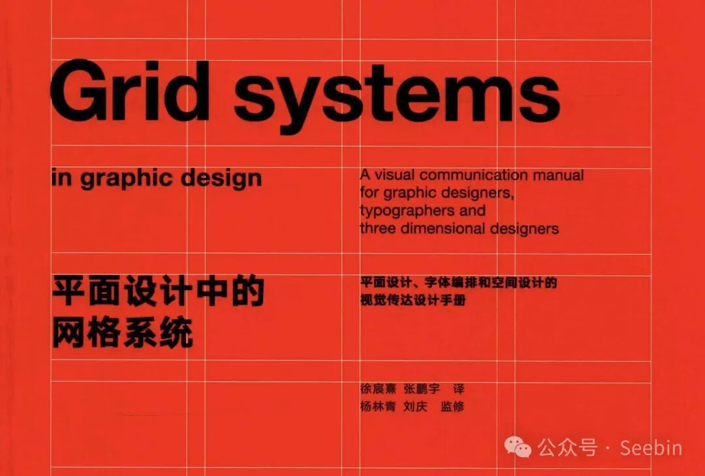

Hyperagent 团队上周发了条推文。

他们说，我们想让 agent 有更好的设计基础。所以我们给它喂了一本 162 页的网格系统 PDF。现在 agent 能用代码遵循网格、输出漂亮布局了。

推文附带一个 18 秒的视频。视频里，Claude Code 读了一堆命令行输出，然后生成了一张页面。严格 12 列网格、字体层次分明、间距规整。我放大看了两遍，确认不是人工后期加的效果。

这条推文 72 万次观看、2200 次收藏。

收藏远超转发的数据说明一件事。想做这件事的人，远比已经做成的人多。

但 Hyperagent 的方案只是冰山一角。这个星期，GitHub 上至少冒出了三个同方向的爆款项目，加上他们的一共四个。四个项目从不同路径解决了同一个问题。让 AI agent 写的前端，不再有一股「AI 味」。

这个现象值得认真聊一聊。

## 一个共同的问题

所有用过 Claude Code 或 Cursor 或 Codex 写前端的人，都有同一种感觉。

它生成的页面，功能上没问题。按钮能点、表单能提交、响应式也能看。但你总觉得哪里不对。

字体怎么看怎么是 Inter。颜色总是那种紫蓝渐变。布局一定是居中 Hero + 三列卡片。你把鼠标挪到卡片上，没有 hover 效果。整个页面像被压缩过的模板，但不是任何一个具体模板，像是模型从几百万个页面里「平均」出来的一个最安全的输出。

我管它叫「AI 中位数审美」。它不丑，但它没有判断力。

你让 AI 做个餐饮品牌页面，和让它做个区块链数据面板，出来的东西长得差不多。这在一个有审美意识的设计者眼里是灾难，但在模型眼里只是「选择概率最高的 token」。它们不是故意的。它们只是不知道什么叫做得好。

所以问题变成了，你能教 AI 审美吗？

## 方案一：Taste-Skill

先说 GitHub 上最火的。36.8k 星。

它叫 Taste-Skill，作者是 Leonxlnx。它的思路很简单——你作为开发者，不需要告诉 agent「这里用 16px 那里用 24px」。你只需要告诉它你想要什么风格。

Taste-Skill 的核心是三个可调参数。

DESIGN\_VARIANCE 控制布局的实验性。低分是居中对称的传统排布，高分是打破网格的非对称设计。MOTION\_INTENSITY 控制动效深度。低分只有 hover 反馈，高分会有滚动触发的动画、磁吸效果甚至视差滚动。VISUAL\_DENSITY 控制信息密度。低分像画廊，大量留白。高分像仪表盘，紧凑高效。

你设好三个数值，agent 拿着它们去生成。这就是把审美转化成约束条件的思路。

它不是一个 Skill，是一组 13 个。有通用版、极简版、粗野主义版、高端视觉版、Google Stitch 兼容版。甚至还有一个 image-to-code 流程，先生成参考图，再由 AI 对照着写代码。

Taste-Skill 的安装是一行命令：

```
npx skills add https://github.com/Leonxlnx/taste-skill
```

装完后你把三个参数调到合适的数值，然后像平常一样用 agent 写前端。区别在于，它不再问你「用什么字体」，而是自动推断项目的设计语境——工业品类、消费品牌还是数据面板——然后匹配正确的风格。

从用户反馈来看，最受欢迎的是它的 imagegen 功能。开发者先用 ChatGPT Images 生成一个视觉参考，再让 agent 对照参考图编码。先定视觉目标再动手，比让 agent 自由发挥稳定得多。

Taste-Skill 的现象级数据说明一件事。36.8k 的人不只是在等一个更好看的 UI 框架。他们在等一个能理解「好看」是什么的 agent。这是需求的不同层次。

## 方案二：Hallmark

如果说 Taste-Skill 是给 agent 一个审美调色盘，那 Hallmark 就是给 agent 装了一道质检流水线。

Hallmark 是 Together AI 开源的项目。37 个版本迭代，名字起得很有意思。「hallmark」这个词本身就有「品质印记」的意思。他们的目标，就是让 AI 的输出打上一个「真的用心了」的标记。

20 套主题、4 种设计风格、21 种宏观布局结构、57 道 Slop 测试门。

我说的不是产品说明书。这些数字在 Hallmark 的体系里就是可执行的规则。

Taste-Skill 的方式是「给约束条件」，Hallmark 的方式是「给反例和修复方法」。

它的 SKILL.md 分三层。Anti-pattern 层罗列 AI 最常犯的视觉错误。紫蓝渐变（是的，它专门列了这一条）、默认 Tailwind 色板、三列等宽图标卡片、斜体标题、AI 重新画 UI 控件而不是用原生元素。每一项都有具体的「为什么不对」和「怎么改」。

Pro-pattern 层是正面的替代方案。故意的色彩搭配、层次分明的字号体系、非对称布局。Quality verification 层是一个 58 道的 slop test。agent 在输出页面之前，必须自己跑一遍这个测试。一道门没过，就回去改。

安装同样是一行命令

```
npx skills add nutlope/hallmark
```

装好之后，Hallmark 还有一个很绝的功能。它不只是生成。你还可以让它审查现有的页面。

hallmark audit 命令会扫描你的页面，输出一份改动清单。hallmark redesign 不保留原有结构，只保留内容和信息架构，换一套全新的视觉指纹重建。hallmark study 接收一个截图或 URL，反向提取它的设计 DNA。宏观结构、字体配对、色彩锚点，然后生成一个 design.md 供其他 AI 工具使用。它甚至包含一条「禁止像素级复制付费模板」的规则。

这不是一个设计工具。这是一个有判断力的 design reviewer。它不会帮你画图，但会告诉你什么画得好。

## 方案三：Hyperagent 网格 Skill



回到文章开头。Hyperagent 团队做的事，和上面两个项目方向不同。

Taste-Skill 和 Hallmark 是「约束 agent 的行为」。Hyperagent 是「给 agent 一个知识锚点」。

他们找到 Josef Müller-Brockmann 的网格系统 PDF，162 页。这是瑞士平面设计的圣经级著作，定义了现代版式设计的 12 列数学网格系统。他们把它公开成了一个 JSON 格式的 Skill 定义文件，给 Hyperagent 平台内部用的。

效果就是推文里那段 18 秒视频。

规则很严苛。12 列数学网格、最多使用三种颜色、禁止渐变和阴影、字体层次必须有明确的主次。一共只有几条规则。但就是这几条，把 Agent 从「凭感觉排 layout」变成了「按网格系统排 layout」。

想知道具体规则的，JSON 地址在这里：

```
https://github.com/alexmcdonnell-airtable/hyperagent-public-skills/blob/main/skill-muller-brockmann-grid-systems.json
```

JSON 里包含大量的设计指导——从模块化网格、基线锁定、字体选择到色彩约束。我最喜欢的一句：

> 「避免 Claude look（暖白底色）和蓝紫渐变——这是硬性规则。」

Hyperagent 的这种方案和前面两个并不互斥。你可以装上 Taste-Skill 作为审美调色盘，再加上 Hallmark 的质量门做最后一关检查。三个方向各管一块，一个管审美方向，一个管质量验收，一个管布局锚点。

但 Hyperagent 项目验证了一件事。你的设计资源不只是给人看的参考书。把一个 PDF 的核心规则提炼成简洁的约束条件赋予你的 agent，它就变成了 agent 的能力底座。任何带规则的 PDF 都有可能。

## 方案四：Design-QA

前面三个方案都是「生成」，第四个是「审查」。

Design-QA 的作者是 Alex410000。它不生成任何代码。它就是评审。

你做完一个页面，让 Design-QA 来打分。它基于 Nielsen 的 10 条可用性启发式标准，加上 31 个 AI Slop 特征检测模式。渐变文字、默认 Inter、居中 Hero 布局、嵌套卡片、缺少的交互状态。输出一份结构化的审核报告，按优先级排列问题。

它还附带一个 CLI 脚本（scan.mjs）。14 个 slop 模式不需要 LLM 就能识别，直接正则扫描。这意味着你可以把它集成进 CI/CD 流水线里。

如果你已经用上了 Claude Code 和 Cursor，已经依赖它们写了大量前端代码。这时候不是「下次怎么让 agent 写得更好」，而是「手上几千行 agent 写的前端，有多少需要改」。Design-QA 的作用就在这。

## 四个方案怎么选

我试着画个简单的场景匹配。

你是从头做一个新项目，中间会用大量 agent 生成 UI。先装 Taste-Skill，定义好设计参数。再装 Hallmark，让每段输出都过一遍 slop test。如果你是网格系统爱好者，对排版有执念，给 agent 喂一份 Hyperagent 那样的网格规范 PDF。

你有想复用的项目或者现有代码要改。装 Design-QA。它不是帮你写的工具，但在你出手改之前能指出问题在哪。

至于搭配用还是单用。如果你对排版有追求，可以先装 Taste-Skill 定审美方向。装 Hallmark 做质量验收。再借鉴 Hyperagent 的思路，加一条网格约束当布局锚点。项目写完了，跑一遍 Design-QA 扫雷。四个方案各管一段，不冲突。

我个人觉得，Hallmark 的 slop test 应该成为所有用 agent 写前端的开发者的标配。它不挑设计风格，它只防止你输出的东西看起来很糊。57 道门过一遍，至少你不会在客户面前翻车。

## 实战

最后给一个实操步骤。

打开终端。

```
npx skills add https://github.com/Leonxlnx/taste-skill  
npx skills add nutlope/hallmark
```

两条命令，30 秒。

然后打开你的 Claude Code，输入这句话——「创建一个我的个人主页」。

在 Taste-Skill 和 Hallmark 介入之前，你会得到一套 Inter 字体 + 紫蓝渐变 + 三列卡片 + 居中 Hero。标准的 AI 中位数审美。

在它们介入之后，agent 会先读你项目的设计风格，确定你要什么视觉定位。然后选择一个宏观结构、匹配一套色彩方案、排版时遵循网格，生成完后自己跑一遍 slop test，然后再把页面交给你。

如果你想更激进一点，试试 Hyperagent 的路子。去 GitHub 上看他们的 JSON 文件，里面塞满了瑞士平面设计的一线经验。从中提取几条核心规则，贴进你的 AGENTS.md 或者对话开头：

> 12 列数学网格对齐 · 最多三种颜色 · 禁用渐变和阴影 · 8px 基准间距 · 字体层次主次分明。每次输出前自查。

这就是 Hyperagent 方案想传递的精髓。然后找一个你信奉的设计规范 PDF，Müller-Brockmann 的网格书也好，你团队的 Design System 文档也罢，把核心规则提炼成类似的形式，塞进你的 .claude 目录。不是让 agent 全文背诵，是把规则编码成它生成布局时随时可查的约束集。

装完这些之后，效果立竿见影。字体不再是 Inter（它被明确列入了禁止项），配色不再紫蓝渐变，布局不再是三列居中。页面看起来像花过心思排过版，而不是模型随机采样的默认输出。

我不敢说这页面「高级」。但它至少不尴尬了。它看起来像有人花过心思，而不是模型随机采样的结果。

这可能是这个时代创作者直面 AI 时最有趣的问题之一。你如何在自己的作品里，去掉「AI 的味道」，保留「人的痕迹」。

我觉得 Skill 是个不错的起点。

至少，它是你可以马上动手做的事情。

—往期精选—

[Text-To-Lottie 教会我的事：给 Agent 搭一个创意验收闭环](https://mp.weixin.qq.com/s?__biz=MzI2NjUwMDIyOA==&mid=2247483717&idx=1&sn=5ced0ad5e3dc73fbe422f53aefd45b0a&scene=21#wechat_redirect)

[Harness Engineering 更上一层了，这一次是 Loop Engineering](https://mp.weixin.qq.com/s?__biz=MzI2NjUwMDIyOA==&mid=2247483686&idx=1&sn=d40b6ffcb126e06f86c9faa59e26bd83&scene=21#wechat_redirect)

[你的第一条 Agent Loop 怎么设计：从零搭建指南](https://mp.weixin.qq.com/s?__biz=MzI2NjUwMDIyOA==&mid=2247483694&idx=1&sn=307260403809f0ae76562663708442bf&scene=21#wechat_redirect)

[黑盒研发来了：企业级 Agent 的下一阶段](https://mp.weixin.qq.com/s?__biz=MzI2NjUwMDIyOA==&mid=2247483738&idx=1&sn=21cb1b4c1a088c89739097538fa98188&scene=21#wechat_redirect)

[Agent Memory 正在成为新的技术债](https://mp.weixin.qq.com/s?__biz=MzI2NjUwMDIyOA==&mid=2247483724&idx=1&sn=c4a54040ac87bdd30fe5220a479749fa&scene=21#wechat_redirect)