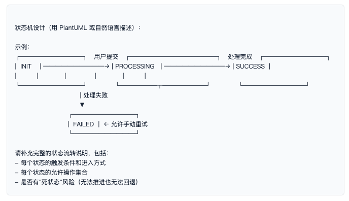
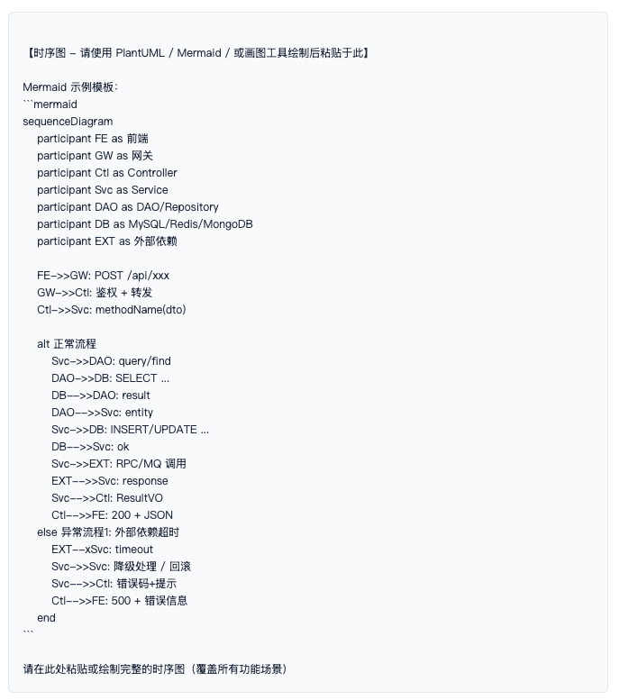
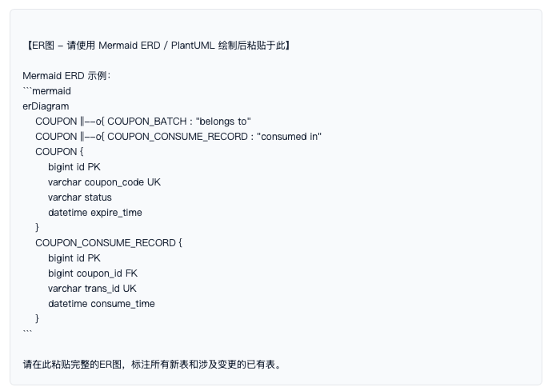

# 技术方案设计文档

## 1文档组织与前置约定

**目的：**定义文档交付结构、明确哪些模块需要详细设计、建立PRD与详细设计的边界约定，确保方案编写和执行标准一致。

### 1.1文档交付结构 必填

说明本次交付的文档组织方式：*1份架构设计文档 + N份模块详细设计附录*。架构文档描述系统级决策，附录按模块独立阐述实现细节。

请说明： - 架构设计文档涵盖范围（系统整体架构、技术选型依据、公共组件设计等） - 模块详细设计附录清单（模块名称 / 负责人 / 预计完成日期） - 各附录与架构文档的关联关系（通过功能点名称关联）

### 1.2模块详细设计判断规则 必填

并非所有模块都需要做详细设计。以下为*必须做详细设计*的判断标准：

| 模块类型 | 是否需要详细设计 | 判断理由 |
| --- | --- | --- |
| 复杂业务逻辑（含多分支、多状态流转） | ✅ 必须 | 逻辑复杂，不画时序图说不清 |
| 涉及资金、安全、权限校验 | ✅ 必须 | 高风险，需明确原子性和审计边界 |
| 性能敏感接口（高QPS/大数据量） | ✅ 必须 | 需提前设计索引、缓存、批量策略 |
| 多系统交互（跨微服务RPC/MQ调用） | ✅ 必须 | 需时序图标明调用链和异常处理 |
| 后台定时任务 | ✅ 必须 | 需专项设计（见第八章） |
| 简单CRUD查询（无复杂业务逻辑） | ❌ 不需要 | 纯数据读写，接口文档即可覆盖 |
| 纯UI交互页面 | ❌ 不需要 | 前端原型已说明交互逻辑 |

**⚠️ 一票否决提醒 V4：**如果功能涉及资金/安全/权限校验但未做详细设计（对应上表中"必须"类型），方案将**直接不予通过**。

请列出本次涉及的需要做详细设计的模块清单，并说明判断依据。

### 1.3PRD边界约定 必填

*PRD 定义「做什么」，详细设计定义「怎么做」。*本文档不得重复PRD中的功能点描述、用户故事、验收标准等内容。 如需引用PRD，通过功能点名称或编号关联即可。

请说明： - 关联的PRD文档名称/链接 - 本方案涉及的功能点清单（名称/编号即可，不重复PRD详细描述） - 如有本方案与PRD不一致处，需在此标注差异项

**功能点逐项对应检查清单（A1）：***确保PRD中的每个功能点在方案中都有对应设计，避免遗漏。*

| PRD功能点编号/名称 | 本方案对应章节 | 是否覆盖 | 备注 |
| --- | --- | --- | --- |
|  |  | ✅ 已覆盖 / ⚠️ 部分 / ❌ 未覆盖 |  |
|  |  |  |  |
|  |  |  |  |

**⚠️ 一票否决提醒 V9：**如果功能点与PRD需求严重脱节（逐项对应清单中出现 ❌ 未覆盖 的情况且无合理解释），方案将**直接不予通过**。

## 2业务逻辑闭环与边界

**目的：**明确新功能的业务边界，对齐PRD规则，防范特殊路径遗漏。

### 2.1前置与后置条件 必填

| 类型 | 条件描述 |
| --- | --- |
| **前置条件** | 触发该操作前，系统和数据必须满足的硬性状态。示例： • 订单状态必须为"待签收" • 单次提交码数量 ≤ 100 • 当前用户具有对应角色的操作权限 |
| **后置通知** | 操作成功后需要触发的后续动作。示例： • 发送 MQ 通知下游统计模块 • 异步生成导出文件 • 更新 Redis 缓存/计数器 • 记录审计操作日志 |

### 2.2状态机模型流转图 涉及多状态时必填

如果涉及多状态流转的功能（如 INIT → PROCESSING → SUCCESS / FAILED），请用 PlantUML 或文字标明每种状态的流转触发点，*严防"无法推进的死状态"*。

### 2.3异常路径与业务兜底流程 必填

如果外部依赖服务（如 Dubbo RPC）超时或报错，该新功能采取哪种兜底策略？

| 异常场景 | 触发条件 | 处理策略 | 兜底方案 |
| --- | --- | --- | --- |
| 外部RPC超时 |  | □ 前端报错 □ 自动重试 □ 人工审核 □ 静默降级 |  |
| 外部RPC返回业务错误 |  | □ 前端报错 □ 自动重试 □ 人工审核 □ 静默降级 |  |
| 数据库连接异常 |  | □ 前端报错 □ 自动重试 □ 人工审核 □ 静默降级 |  |
| MQ发送失败 |  | □ 前端报错 □ 自动重试 □ 人工审核 □ 静默降级 |  |
| 并发冲突 |  | □ 前端报错 □ 自动重试 □ 人工审核 □ 静默降级 |  |

### 2.4降级方案与重试参数配置 必填

当关键外部依赖不可用时，需定义独立的降级逻辑和兜底方案。同时明确重试参数的精确配置，避免盲目重试导致雪崩。*本条来自评审检查清单 E3/E4。*

**降级方案：**

| 依赖服务 | 降级触发条件 | 降级策略 | 用户体验影响 | 恢复后处理 |
| --- | --- | --- | --- | --- |
| 如：用户中心RPC | 超时 > 500ms 或 连续3次失败 | □ 返回缓存数据 □ 静默跳过 □ 返回默认值 □ 功能降级提示 | 用户看不到昵称，显示"用户\*\*\*\*\*\*\*\*" | □ 自动恢复 □ 需手动切回 |
|  |  |  |  |  |
|  |  |  |  |  |

**重试参数配置表：**

| 参数 | 推荐值 | 说明 |
| --- | --- | --- |
| 最大重试次数 | \_\_\_\_\_\_ 次（建议 ≤3） | 超过此次数后进入最终失败处理 |
| 重试间隔 | □ 固定 \_\_\_\_\_\_ ms □ 指数退避（初始 \_\_\_\_\_\_ ms，倍增×2，最大 \_\_\_\_\_\_ ms） | 指数退避可有效防止雪崩 |
| 退避策略 | □ 固定间隔 □ 指数退避 □ 随机抖动（防止惊群效应） □ 自定义：\_\_\_\_\_\_\_\_ | 多实例场景建议开启随机抖动 ±20% |
| 最终失败处理 | □ 写入死信队列 □ 人工介入 □ 告警通知 □ 丢弃（附充分理由） | 资金类操作不得丢弃 |
| 告警方式 | □ 企业微信 □ 邮件 □ Grafana/Prometheus □ 其他：\_\_\_\_\_\_\_\_ | 最终失败必须触发告警 |

**⚠️ 防雪崩检查：**当重试次数 × 重试间隔 > 上游调用方超时时间时，会形成"上游已超时、下游还在重试"的资源浪费。请确认重试总时长 ≤ 上游超时时间的 80%。

## 3⭐ 技术实现设计（核心）

**目的：**这是详细设计的**核心交付物**。用时序图和伪代码/流程图清晰表达"系统怎么实现"，从用户操作到后端链路全透明。

**⚠️ 注意：本章是原"模板：新功能技术方案"缺失的核心内容，来自"12 功能技术设计方案"的详细设计要求。**

### 3.1⭐ 时序图 核心产出物

从用户前端操作开始，逐层画出 *前端 → 网关 → Controller → Service → 中间件（Redis/DB/MQ）→ 跨系统调用 → 响应返回*的完整链路。 用 `alt/opt`标注分支，关键步骤标注异常处理策略。时序图应覆盖"正常流程 + 异常流程 + 边界流程"三类场景。

**要求：**至少包含前端/网关/核心Service/DAO/数据库/外部依赖六层，关键交互标注方法名和传输对象。

### 3.2核心处理逻辑 必填

对于核心接口/功能，提供伪代码或流程图来描述主处理流程和分支判断逻辑。

### 3.3数据变更明细 必填

列出本功能涉及的所有数据库表操作。多条表操作必须标注是否在同一事务内。

| 表名 | 操作类型 | 变更字段 | 条件/过滤 | 事务归属 |
| --- | --- | --- | --- | --- |
|  | SELECT / INSERT / UPDATE / DELETE |  | WHERE条件 | 事务1 / 事务2 / 无事务 |
|  |  |  |  |  |

## 4接口契约与API设计

**目的：**规范前后端或服务间的交互契约，严格防范安全漏洞与不兼容变更。

### 4.1协议与语义选择 必填

明确接口协议类型：□ RESTful □ Dubbo RPC □ gRPC □ 其他：\_\_\_\_\_\_\_\_ 如果是涉及数据导出或对业务状态有副作用的操作，坚决杜绝使用 GET 请求（避免敏感参数暴露在 URL 中或被缓存），必须改用 POST + @RequestBody。

### 4.2接口定义 必填

| 接口名称 | 路径 | 请求方式 | 功能描述 | 调用方 |
| --- | --- | --- | --- | --- |
|  | /api/v1/xxx | POST/GET |  | 前端/其他服务 |
|  |  |  |  |  |

### 4.3入参定义 必填

入参对象必须搭配 `@Validated`触发校验。数量、长度类参数必须搭配 `@Size(max=100)`或 `@Max`设置硬性上限。

| 字段名 | 类型 | 必填 | 校验规则 | 边界值/上限 | 示例 |
| --- | --- | --- | --- | --- | --- |
|  | String/Integer/Long/List | 是/否 | @NotNull @Size(max=100) |  |  |
|  |  |  |  |  |  |

### 4.4出参定义 必填

列表查询必须统一包装为包含分页元数据 `(total, pageNo, pageSize)`的结构，禁止直接返回裸 List。

| 字段名 | 类型 | 空值含义 | 说明 |
| --- | --- | --- | --- |
|  |  | null/空字符串/空数组分别代表什么？ |  |

**错误码定义：**

| 错误码 | HTTP状态码 | 错误信息 | 触发条件 | 用户提示 |
| --- | --- | --- | --- | --- |
|  | 200/400/500 |  |  |  |
|  |  |  |  |  |

### 4.5接口异常场景处理 必填

对每种接口级异常，明确对应的错误码、错误信息和处理方式。

| 异常类型 | 错误码 | 错误信息 | 处理方式 |
| --- | --- | --- | --- |
| 参数校验失败 |  |  | 返回校验失败详情 |
| 业务规则不满足 |  |  | 返回业务错误提示 |
| 外部依赖超时 |  |  | □ 重试 □ 降级 □ 报错 |
| 数据不存在 |  |  | 返回空/404/业务错误 |

### 4.6幂等设计 必填

描述本接口重复调用时的处理策略：是基于业务唯一键去重、分布式锁、还是数据库唯一索引？

请说明： - 幂等键是什么（如：订单号、交易流水号、业务唯一键组合） - 幂等实现方式（□ 数据库唯一索引 □ Redis setNX □ 分布式锁 □ 其他：\_\_\_\_\_\_\_\_） - 重复调用的返回策略（□ 返回首次结果 □ 返回幂等错误码 □ 返回成功但标记为重复）

### 4.7性能要求 必填

| 指标 | 目标值 | 评估依据 |
| --- | --- | --- |
| 预期 QPS（每秒请求数） |  |  |
| 平均响应时间 |  |  |
| TP99 响应时间 | < \_\_\_\_\_\_ ms |  |
| 并发用户数 |  |  |
| 单次最大数据量 |  |  |

### 4.8权限与安全注解 必填

☐ Controller 类/方法级别是否明确标注了权限控制注解（如 `@IsvResource`、`@RequiresPermissions`）？

☐ 是否对接口访问做了角色/权限级别的校验，*严防因新增接口忘记加注解导致未授权访问漏洞*？

请列出每个接口需要的权限/角色：

### 4.9版本管理与向前兼容 涉及接口变更时必填

☐ 新功能是否引入了新的接口路径（如 `/v2/`）？

☐ 若在原有接口上修改，如何保证老版本前端调用时不崩溃？

请说明兼容策略：□ 新增路径 /v2/ □ 老接口保留+标记Deprecated □ 字段向后兼容（新增字段不删老字段） □ 其他

**功能级兼容性评估（A5）：***新功能是否可能破坏已有功能？需逐项确认。*

| 已有功能模块 | 影响类型 | 影响说明 | 是否需回归测试 |
| --- | --- | --- | --- |
|  | □ 无影响 □ 字段变更 □ 逻辑分支影响 □ 性能退化 □ 数据格式变更 |  | □ 是 □ 否 |
|  |  |  |  |

### 4.10安全防护扩展 必填

覆盖敏感数据加密、防攻击措施、审计日志三个维度。*本条来自评审检查清单 F2/F3/F4。*

**⚠️ 安全维度占评审权重 9%，F2-F4 三项缺失将直接导致安全性评分严重不足，且可能触发一票否决项 V6。**

**F2 敏感数据加密：**

| 数据类型 | 是否涉及 | 加密方式 | 存储位置 | 日志脱敏 |
| --- | --- | --- | --- | --- |
| 密码/支付密码 | □ 是 □ 否 | BCrypt / SCrypt / PBKDF2 |  | 禁止打印 |
| 手机号 | □ 是 □ 否 | □ AES-256 □ SM4 □ 其他 |  | 掩码：138\*\*\*\*5678 |
| 身份证号 | □ 是 □ 否 | □ AES-256 □ SM4 □ 其他 |  | 掩码：320\*\*\*\*\*\*\*\*\*\*\*1234 |
| 银行卡号 | □ 是 □ 否 | □ AES-256 □ SM4 □ 其他 |  | 掩码：6222\*\*\*\*1234 |
| 其他敏感数据 | □ 是 □ 否 |  |  |  |

☐ 确认所有敏感数据字段均在日志框架中配置了脱敏规则（如 logback DesensitizationConverter），杜绝隐私泄露。

**F3 防攻击措施：**

☐ **SQL 注入防护：**所有动态 SQL 是否使用参数化查询（占位符 `#{}`），严禁字符串拼接？MyBatis 中确认无 `${}`拼接用户输入。

☐ **XSS 防护：**输出到前端的用户输入数据是否经过 HTML 实体编码或使用安全渲染？是否接入 Web 安全过滤器？

☐ **限流接入：**新接口是否通过 Sentinel / Nginx 配置了 QPS 限流规则？默认限流阈值：\_\_\_\_\_\_ QPS。

☐ **参数校验：**所有入参 DTO 是否使用 `@Validated`+ JSR-303 注解（如 @NotNull/@Size/@Pattern），杜绝非法参数穿透到业务层？

☐ **CSRF 防护：**涉及状态变更的接口（非GET请求）是否配置了 CSRF Token 校验或同源策略？

**F4 审计日志：**

☐ 所有新增/修改/删除操作是否强制记录审计日志（操作人、操作时间、操作内容、IP地址）？

☐ 涉及资金的操作是否采用独立审计表持久化存储，确保不可篡改？

☐ 审计日志是否与业务日志分离，存储于独立表或独立日志文件？

| 操作类型 | 审计表/日志文件 | 记录字段 | 保留周期 |
| --- | --- | --- | --- |
|  |  | operatorId, operatorName, operation, targetId, beforeValue, afterValue, ip, timestamp | \_\_\_\_\_\_ 天/月/年 |
|  |  |  |  |

## 5数据模型与存储设计

**目的：**规划数据存储结构，提前设计好索引，杜绝全表扫描。

### 5.1数据库变更评估 必填

| 变更项 | 内容 | 风险评估 |
| --- | --- | --- |
| 变更方式 | □ 现有表追加字段 □ 新建独立表（一对一/一对多） □ 新建 MongoDB 集合 |  |
| DDL风险 | 追加字段是否会导致现有大表发生 DDL 锁表风险？ 表当前数据量：\_\_\_\_\_\_ 行 预计DDL耗时：\_\_\_\_\_\_ | 高/中/低 |

新建表请附建表DDL语句：

-- 请粘贴 CREATE TABLE 语句

### 5.2索引设计 必填

针对新功能的高频查询与组合过滤场景，设计单列或复合索引。*防错检查：是否存在隐式全表扫描风险（如 MongoDB 多字段查询无复合索引、MySQL 使用前导通配符 LIKE '%xxx%'）？*

| 表名 | 索引名称 | 索引字段 | 索引类型 | 覆盖查询场景 |
| --- | --- | --- | --- | --- |
|  | idx\_xxx |  | 普通/唯一/复合 |  |

### 5.3数据生命周期与冷热分离 建议评估

| 评估项 | 估算值 |
| --- | --- |
| 每日数据增量 | 预计 \_\_\_\_\_\_ 条/天，\_\_\_\_\_\_ MB/天 |
| 年增长率 | 预计年增长 \_\_\_\_\_\_ GB |
| 归档策略 | 是否需要定期归档/清理/转入冷存储（如 OSS/冷库）？ □ 不需要 □ 按月归档 □ 按季度归档 □ 按年归档 |

### 5.4变更范围标注与数据迁移方案 涉及数据变更时必填

所有涉及数据库变更的项，必须明确标注变更类型（新增/修改/废弃），并对存量数据提供迁移方案。*本条来自评审检查清单 D2/A2。*

**A2 变更范围总览：**

| 变更对象 | 变更类型 | 变更前 | 变更后 | 兼容性 |
| --- | --- | --- | --- | --- |
| 表名/字段名/接口名 | 🆕 新增 / ✏️ 修改 / 🗑️ 废弃 | 变更前状态描述 | 变更后状态描述 | □ 向前兼容 □ 向后兼容 □ 不兼容 |
|  |  |  |  |  |

**D2 数据迁移方案：**

| 迁移项 | 迁移内容 | 影响行数 | 迁移策略 |
| --- | --- | --- | --- |
| 存量数据回填 | 如：为 existing 行设置 default 值 'N' | 预计 \_\_\_\_\_\_ 行 | □ 上线前一次性脚本 □ 分批迁移 □ 懒迁移（读取时按需处理） |
| DDL执行顺序 | 如：先 ADD COLUMN → 脚本回填 → 再 ADD INDEX → 最后 NOT NULL |  | DDL脚本清单及执行顺序 |
| 停机窗口 | 是否需要停服执行？ | □ 是 □ 否 | 预计停机 \_\_\_\_\_\_ 分钟 |
| 回滚方案 | DDL回滚或业务回滚 | □ 可回滚 □ 不可回滚（附风险说明） |  |

**⚠️ 不可回滚检查：**若 DDL 包含 DROP COLUMN / DROP TABLE / TRUNCATE 等不可逆操作，必须在变更前备份数据，并在方案中附备份恢复流程。

### 5.5ER图与缓存变更评估 涉及新表或缓存变更时必填

*本条来自评审检查清单 D3（ER图）/ D5（缓存变更）。*

**D3 ER图：**涉及新建表或表关系变更时，需附 ER 图（可使用 Mermaid ERD / PlantUML / 专业绘图工具）。

**D5 缓存变更评估：**

| 缓存Key | 变更类型 | 变更说明 | 对现有功能影响 | 预热策略 |
| --- | --- | --- | --- | --- |
| 如：coupon:list:user:{userId} | 🆕 新增 / ✏️ 修改 / 🗑️ 废弃 | 新增字段cacheVersion | 旧缓存无此字段，需刷新 | □ 上线后逐条懒加载 □ 全量预热脚本 □ 设置合理TTL自动过期 |
|  |  |  |  |  |

☐ **缓存一致性：**数据库更新后，缓存是否同步更新/失效？是否存在"先更新DB、后删缓存"的时序导致脏读？建议使用 Cache-Aside + 双删策略或订阅 Binlog 异步刷新。

## 6事务与分布式数据一致性

**目的：**防范假事务、并发重复插入或数据不一致问题。

### 6.1本地事务边界 必填

明确哪些操作必须被同一个本地事务覆盖（要么同时成功，要么同时回滚）。*检查是否存在不支持本地 ACID 事务的数据源（如单节点 MongoDB 无法直接靠 @Transactional 回滚，需使用 Session API 或业务补偿）。*

请说明： - 事务范围（涉及哪些表/操作） - 事务隔离级别 - 是否有非ACID数据源参与（MongoDB/Redis/ES等），若有，如何处理回滚？

### 6.2分布式一致性与消息队列（MQ） 必填

☐ 新功能如果同时操作了"数据库 + Redis 计数器 + 发送 MQ"，发生异常时是否有补偿机制？

☐ 作为 MQ 消费者时，新功能是否基于业务唯一键（如订单号/流水号）实现了消费幂等性处理？

请说明 MQ 场景的补偿策略和幂等机制。

### 6.3高并发防重插入 必填

新功能是否存在"先检查数据是否存在，再执行插入"的模式？高并发时这极易导致重复插入脏数据。*方案中准备采用何种手段保证原子性？*

请说明防重插入策略： □ 数据库物理唯一索引（推荐，最可靠） □ 分布式锁（锁的TTL = \_\_\_\_\_\_ 秒，需确保覆盖最长业务执行时间） □ INSERT ... ON DUPLICATE KEY UPDATE □ Redis setNX + 业务唯一键 □ 其他：\_\_\_\_\_\_\_\_

## 7性能、容量与防重

**目的：**自证新功能上线后，不会拖垮原有系统的老业务。

### 7.1资源消耗与批量控制 必填

☐ 如果逻辑中包含 forEach 等循环，*严禁在循环体内逐条调用数据库或 RPC 接口（N+1查询问题）*，必须在循环外进行批量预加载。

☐ 涉及大批量异步操作（如大宗团购、大批量码核销）时，方案是否改为"异步任务 + 文件服务器（OSS）下载"模式，拒绝同步 HTTP 长时间挂起？

请列出循环操作清单及批量优化方案。

### 7.2防重提交机制 必填

对于核心写操作、资金或状态变更接口，前端防重复点击之外，后端如何设计防重机制？*建议：Redis setNX + 业务唯一键。*

请说明： - 防重键设计（如：userId + 操作类型 + 业务ID 组合） - 防重窗口时长（如：5秒内同一操作不允许重复提交） - 防重实现方式（□ Redis setNX □ Token机制 □ 数据库唯一约束 □ 其他）

### 7.3迭代性能影响评估 必填

新功能上线后，对比现有基线评估对系统性能的影响。*本条来自评审检查清单 G1。*

| 评估维度 | 现有基线 | 上线后预估 | 增幅 | 是否在可接受范围 |
| --- | --- | --- | --- | --- |
| 数据库QPS增量 | 当前峰值 \_\_\_\_\_\_ QPS | 新增 \_\_\_\_\_\_ QPS | \_\_\_\_\_\_ % | □ 是 □ 否（附优化方案） |
| Redis带宽增量 | 当前峰值 \_\_\_\_\_\_ MB/s | 新增 \_\_\_\_\_\_ MB/s | \_\_\_\_\_\_ % | □ 是 □ 否 |
| RPC调用增量 | 当前 \_\_\_\_\_\_ 次/s | 新增 \_\_\_\_\_\_ 次/s | \_\_\_\_\_\_ % | □ 是 □ 否 |
| MQ消息增量 | 当前 \_\_\_\_\_\_ 条/s | 新增 \_\_\_\_\_\_ 条/s | \_\_\_\_\_\_ % | □ 是 □ 否 |
| 磁盘空间增量 | 当前 \_\_\_\_\_\_ GB/天 | 新增 \_\_\_\_\_\_ GB/天 | \_\_\_\_\_\_ % | □ 是 □ 否 |

### 7.4性能优化方案 性能敏感模块必填

针对识别出的性能敏感模块，提供专项优化方案。*本条来自评审检查清单 G3。*

| 优化项 | 当前实现 | 优化方案 | 预期效果 |
| --- | --- | --- | --- |
| 慢查询优化 | 如：全表扫描、无索引查询 | □ 新增索引 □ SQL改写 □ 读写分离 □ 数据归档 | RT从 \_\_\_\_\_\_ ms 降至 \_\_\_\_\_\_ ms |
| 缓存策略 | 如：每次请求都查DB | □ 本地缓存(Caffeine) □ 分布式缓存(Redis) □ 多级缓存 | 命中率目标 \_\_\_\_\_\_ % |
| 连接池优化 | 当前连接池配置 | □ 调大连接数 □ 连接复用 □ 熔断降级 |  |
| 批量/异步处理 | 如：逐条RPC调用 | □ 批量接口 □ 异步化(CompletableFuture) □ MQ削峰 | 吞吐量提升 \_\_\_\_\_\_ % |

**⚠️ 性能敏感模块标注：**若模块判断规则表（1.2）中标注为"性能敏感"，此处必须填写完整的优化方案，不可留空。若无需优化，需说明理由。

## 8⭐ 后台定时任务设计

**目的：**对定时任务做专项设计，确保任务可执行、可控制、可恢复、可监控。

**⚠️ 注意：本章是原"模板：新功能技术方案"完全缺失的章节，来自"12 功能技术设计方案"的定时任务详细设计要求。**

### 8.1触发方式 必填

请说明任务触发方式： □ 定时触发（Cron 表达式：\_\_\_\_\_\_\_\_\_\_\_\_\_\_\_\_\_\_） □ 事件驱动（触发事件：\_\_\_\_\_\_\_\_\_\_\_\_\_\_\_\_\_\_） □ 手动触发（触发入口：\_\_\_\_\_\_\_\_\_\_\_\_\_\_\_\_\_\_） □ 混合模式（说明：\_\_\_\_\_\_\_\_\_\_\_\_\_\_\_\_\_\_）

### 8.2执行逻辑 必填

以流程图或伪代码描述任务完整执行逻辑，包含每一步的数据处理逻辑和分支判断。

【定时任务执行逻辑】  请描述任务执行步骤，格式示例：  1. 从数据库中查询待处理数据（状态=待处理，limit=1000） 2. 逐条处理：    a. 校验数据完整性和业务规则    b. 调用外部RPC服务    c. 更新本地状态为"处理中" → "已完成" / "失败" 3. 汇总处理结果，记录执行日志 4. 如有失败数据，写入重试队列  流程图请在此处或附录中补充。

### 8.3数据量与耗时 必填

| 评估项 | 预估值 |
| --- | --- |
| 单次处理数据量 | \_\_\_\_\_\_ 条/次 |
| 预期执行耗时 | \_\_\_\_\_\_ 秒/分钟 |
| 峰值数据量 | \_\_\_\_\_\_ 条（如大促期间） |
| 单条处理耗时 | \_\_\_\_\_\_ ms |
| 批次大小设计 | 每批 \_\_\_\_\_\_ 条，批间间隔 \_\_\_\_\_\_ ms |

### 8.4失败重试 必填

| 参数 | 值 |
| --- | --- |
| 最大重试次数 | \_\_\_\_\_\_ 次 |
| 重试间隔 | \_\_\_\_\_\_ 秒/分钟（□ 固定间隔 □ 指数退避） |
| 最终失败处理 | □ 写入死信队列 □ 人工介入 □ 告警通知 □ 丢弃（附理由） |
| 告警方式 | □ 企业微信 □ 邮件 □ Grafana □ 其他：\_\_\_\_\_\_\_\_ |

### 8.5幂等保证 必填

重复执行不会产生脏数据的具体机制。

请说明： - 幂等判断依据（如：基于业务ID + 处理状态的 CAS 更新） - 具体实现方式（□ 数据库状态机约束 □ 分布式锁 □ 唯一索引 □ 其他：\_\_\_\_\_\_\_\_） - 验证方法（如何证明重复执行不会产生脏数据）

### 8.6并发控制 必填

请说明： - 是否允许多个实例并行执行同一任务？ □ 允许 □ 不允许 - 如果允许，并发数量上限：\_\_\_\_\_\_ - 并发控制机制：□ XXL-Job 分片广播 □ 分布式锁（Redis/ZK） □ 数据库任务表行锁 □ 其他：\_\_\_\_\_\_\_\_ - 分布式锁 TTL：（如有）\_\_\_\_\_\_ 秒（需确保覆盖最长执行时间）

### 8.7监控告警 必填

| 监控指标 | 告警阈值 | 告警方式 |
| --- | --- | --- |
| 任务执行成功率 | < \_\_\_\_\_\_ % |  |
| 任务执行耗时 | > \_\_\_\_\_\_ 秒 |  |
| 任务未按时启动 | 延迟 > \_\_\_\_\_\_ 秒 |  |
| 积压数据量 | > \_\_\_\_\_\_ 条 |  |
| 失败重试次数耗尽 | 单次有 > \_\_\_\_\_\_ 条 |  |

## 9可观测性与可运维性

**目的：**确保新功能上线后不是"黑盒"，出问题能秒级定位。

### 9.1日志打印规范 必填

☐ 关键业务入口、出口以及核心转折点，是否记录了包含请求参数和结果摘要的日志？

☐ *代码中是否存在吞噬异常（空 catch 块或仅打印 e.getMessage() 丢掉堆栈）的隐患？*

请列出关键日志埋点位置和日志级别（INFO/WARN/ERROR）。

### 9.2全链路追踪 必填

☐ 全链路追踪（如 TraceId）是否能完整覆盖新功能的每一个异步线程或微服务模块？

请说明 TraceId 的传递方式和覆盖范围（跨线程、跨MQ、跨RPC）。

### 9.3监控埋点与监控大盘 必填

针对新功能的核心业务指标，设计埋点并准备配置告警。

| 监控指标 | 指标类型 | 采集方式 | 告警阈值 | 大盘/告警平台 |
| --- | --- | --- | --- | --- |
| 如：自主签收成功率 | 业务指标 |  | < 99% | Grafana / Prometheus |
| 如：接口时延 TP99 | 性能指标 |  | > 500ms |  |
| 如：异步队列积压量 | 容量指标 |  | > 1000 |  |

### 9.4功能开关与灰度上线预案 必填

☐ 新功能是否接入了配置中心（如 Nacos）的动态开关，支持"一键开启/关闭"？

☐ 是否支持按商户ID、区域或特定用户群体进行小流量灰度发版？

请说明： - 开关配置项名称和位置 - 灰度策略（按比例/按白名单/按区域） - 灰度观察周期和全量发布条件

## 10代码质量与架构复用

**目的：**保持代码干净整洁，拒绝"为了新功能，无脑复制老代码"。

### 10.1DRY原则 必填

新功能的列表查询、数据转换（VO/DTO 映射），与现有的老功能（如导出功能）是否有大量重复逻辑？*如果有，公共逻辑必须抽取为公共方法，严禁直接复制粘贴代码块。*

请说明： - 是否存在与现有功能的重复逻辑？具体在哪些模块？ - 可抽取的公共方法清单 - 复用的现有组件/Utils

### 10.2设计模式与合理抽象 建议评估

如果该功能未来预计会拓展出更多的子类型或新规则（如：新增不同的核销策略），方案中是否考虑了使用策略模式、工厂模式进行解耦，以避免后续出现臃肿的 `if-else`山？

请说明是否应用了设计模式，以及应用的动机和位置。

### 10.3目录结构合规性自查 必填

☐ 所有单元测试代码、Mock 工具类必须留在 `src/test/java`目录下。

☐ *严格禁止在 src/main/java 生产源码目录中残留任何 TestController 或用于临时修复/Mock 的 main() 方法。*

| 包路径 | 类名 | 用途 | 合规性 |
| --- | --- | --- | --- |
|  |  |  | ✅ 合规 |

## 11⭐ 迭代计划与验收标准

**目的：**定义关键里程碑、每个功能点的验收标准、交付物清单和回滚预案，确保项目可执行、可验收、可回退。本章对应评审一票否决项 **V10**，缺失将导致方案不予通过。

**⚠️ 注意：本章来自 Excel 评审检查清单 I1/I2/I3 + 一票否决项 V10，覆盖评分权重 6%。缺失本章节将导致方案不可评审。**

### 11.1关键里程碑 必填

定义从设计评审到上线的关键时间节点。*本条来自评审检查清单 I1。*

| 阶段 | 计划开始 | 计划完成 | 负责人 | 交付物 | 准入/准出标准 |
| --- | --- | --- | --- | --- | --- |
| 技术方案设计 |  |  |  | 本文档 | 通过技术方案评审 |
| 详细设计评审 |  |  |  | 评审会议纪要 | 所有评审问题闭环 |
| 开发编码 |  |  |  | 代码分支 + 自测报告 | 单元测试覆盖率 ≥ 80% |
| 联调 |  |  |  | 联调通过确认 | 接口联调全量通过 |
| 提测 |  |  |  | 测试用例 | 冒烟测试通过 |
| 灰度上线 |  |  |  | 灰度观察报告 | 无 P0/P1 告警 |
| 全量发布 |  |  |  | 上线确认单 | 灰度观察达标 + 回滚就绪 |

### 11.2功能点验收标准 必填

每个功能点必须定义可执行的验收标准（输入 → 预期输出 → 通过准则）。*本条来自评审检查清单 I2。*

| 功能点 | 测试输入 | 预期输出 | 通过准则 | 测试方式 |
| --- | --- | --- | --- | --- |
| 功能点1：\_\_\_\_\_\_ | 请求参数 / 前置状态 | 返回结果 / 状态变更 / 下游动作 | \_\_\_\_\_\_ | □ 单元测试 □ 集成测试 □ 人工验证 |
| 功能点2：\_\_\_\_\_\_ |  |  |  |  |
| 功能点3：\_\_\_\_\_\_ |  |  |  |  |

☐ 是否覆盖了正常场景 + 边界场景（最小值/最大值/null） + 异常场景（超时/并发/数据不存在）三类？

☐ 验收标准是否可量化、可自动化执行，而非依赖"人工判断"？

### 11.3交付物清单 必填

列出本次迭代需提交的全部产出物。*本条来自评审检查清单 I3。*

| 交付物 | 内容说明 | 负责人 | 状态 |
| --- | --- | --- | --- |
| 代码分支 | 分支名称：feature/\_\_\_\_\_\_，合并目标：\_\_\_\_\_\_ |  | □ 已创建 □ 开发中 |
| DDL脚本 | 数据库变更脚本文件路径 |  | □ 已准备 □ 待执行 |
| 配置变更 | Nacos/Redis/MQ 配置项变更清单 |  | □ 已准备 □ 待发布 |
| API文档 | Swagger/YApi 接口文档更新 |  | □ 已更新 □ 待更新 |
| 测试用例 | 单元测试 + 集成测试用例 |  | □ 已完成 □ 进行中 |
| 部署文档 | 上线步骤、配置变更、依赖检查清单 |  | □ 已完成 □ 待编写 |
| 监控大盘 | Grafana 监控面板配置 |  | □ 已配置 □ 待配置 |

### 11.4灰度与回滚预案 必填

定义灰度策略和回滚操作的具体步骤，这是**一票否决项 V10**的核心组成部分。*本条来自评审检查清单 I3。*

**灰度策略：**

| 灰度维度 | 策略 | 说明 |
| --- | --- | --- |
| 灰度范围 | □ 按白名单 □ 按用户比例（\_\_\_\_\_\_%） □ 按区域 □ 按商户 |  |
| 灰度观察周期 | 每个灰度阶段观察 \_\_\_\_\_\_ 小时/天 | 关注：错误率 / 时延 / 业务指标 |
| 全量发布条件 | 灰度阶段无 P0/P1 告警持续 \_\_\_\_\_\_ 小时 |  |

**回滚预案：**

| 回滚步骤 | 操作内容 | 执行人 | 预计耗时 | 风险说明 |
| --- | --- | --- | --- | --- |
| 步骤1：切流 | 关闭灰度开关 / 切回老版本路由 |  | \_\_\_\_\_\_ 分钟 |  |
| 步骤2：配置回滚 | Nacos/Redis/MQ 配置回退到上一版本 |  | \_\_\_\_\_\_ 分钟 |  |
| 步骤3：数据库回滚 | 执行回滚DDL（如有）/ 业务数据回退脚本 |  | \_\_\_\_\_\_ 分钟 | □ 可回滚 □ 不可回滚（见下文） |
| 步骤4：验证 | 核心接口回归测试 / 监控确认 |  | \_\_\_\_\_\_ 分钟 |  |

☐ **回滚触发条件：**是否明确定义了触发回滚的阈值？（如：错误率 > 1%、TP99 > 2x基线、业务核心指标下降 > 5%）

☐ 如果存在不可回滚的变更（如 DROP COLUMN），是否已在 5.4 数据迁移方案中标注了备份恢复流程？

**⚠️ 一票否决提醒 V10：**如果方案中未提供完整的迭代计划（里程碑 + 验收标准 + 交付物 + 回滚预案），评审将直接不予通过。

## 12技术选型与合规自检

**目的：**确保技术选型符合集团规范，避免使用禁止技术或严重偏离选型清单。本章对应评审一票否决项 **V1/V2**，评分权重 4%。

**⚠️ 注意：本章来自 Excel 评审检查清单 J1/J2/J3 + 一票否决项 V1/V2。本章为伊利集团特定规则章节，若为非伊利项目可标记为"不适用"。**

### 12.1集团禁用技术清单 必填

确认本次方案未使用以下集团禁止技术。*本条对应一票否决项 V1。*

**⚠️ 一票否决提醒 V1：**使用以下任何禁止技术将导致方案不予通过。

| 类别 | 禁止技术 | 替换方案 | 本次是否涉及 |
| --- | --- | --- | --- |
| 操作系统 | Windows Server | Linux（CentOS/Ubuntu/Kylin） | □ 是 □ 否 |
| 数据库 | SQL Server | MySQL / TiDB / PostgreSQL | □ 是 □ 否 |
| 应用服务器 | Weblogic / WebSphere | Tomcat / Undertow / Nginx | □ 是 □ 否 |
| JDK版本 | JDK 8 及以下（新项目） | JDK 21+（LTS版本） | □ 是 □ 否 |
| Node版本 | Node 14 及以下（新项目） | Node 18+ / 20 LTS | □ 是 □ 否 |
| 其他 | 如有其他集团禁用项请补充 |  | □ 是 □ 否 |

### 12.2服务端/前端/中间件选型检查 必填

核对本次新增或变更的技术依赖是否符合集团选型清单。*本条来自评审检查清单 J1/J2/J3，对应一票否决项 V2。*

**⚠️ 一票否决提醒 V2：**新增依赖若严重偏离集团选型清单，需提供充分的偏离理由并经架构组审批，否则方案不予通过。

**J1 服务端依赖：**

| 依赖项 | 版本 | 集团清单允许版本 | 是否合规 | 偏离说明 |
| --- | --- | --- | --- | --- |
| JDK | \_\_\_\_\_\_ | JDK 21+（LTS） | □ 合规 □ 偏离 |  |
| Spring Boot | \_\_\_\_\_\_ | 3.x 系列 | □ 合规 □ 偏离 |  |
| Spring Cloud Alibaba | \_\_\_\_\_\_ | 2023.x 系列 | □ 合规 □ 偏离 |  |
| 其他新增Maven依赖 |  |  | □ 合规 □ 偏离 |  |

**J2 前端依赖：**

| 依赖项 | 版本 | 集团清单允许 | 是否合规 | 偏离说明 |
| --- | --- | --- | --- | --- |
| 框架 | \_\_\_\_\_\_ | Vue 3.x 生态 | □ 合规 □ 偏离 |  |
| UI组件库 | \_\_\_\_\_\_ | Element Plus / TDesign | □ 合规 □ 偏离 |  |
| 构建工具 | \_\_\_\_\_\_ | Vite 5+ | □ 合规 □ 偏离 |  |
| 其他新增npm依赖 |  |  | □ 合规 □ 偏离 |  |

**J3 中间件/数据库依赖：**

| 依赖项 | 版本 | 集团清单允许 | 是否合规 | 偏离说明 |
| --- | --- | --- | --- | --- |
| 注册中心 | \_\_\_\_\_\_ | Nacos 2.x | □ 合规 □ 偏离 |  |
| 配置中心 | \_\_\_\_\_\_ | Nacos / Apollo | □ 合规 □ 偏离 |  |
| 数据库 | \_\_\_\_\_\_ | MySQL 8.0+ / TiDB | □ 合规 □ 偏离 |  |
| 缓存 | \_\_\_\_\_\_ | Redis 7.x + Redisson | □ 合规 □ 偏离 |  |
| 消息队列 | \_\_\_\_\_\_ | RocketMQ / RabbitMQ | □ 合规 □ 偏离 |  |
| 定时任务 | \_\_\_\_\_\_ | XXL-Job | □ 合规 □ 偏离 |  |
| 其他 |  |  | □ 合规 □ 偏离 |  |

### 12.3新增依赖审批 涉及新增依赖时必填

所有不在集团标准选型清单中的新增依赖，需在此列明并提交架构组审批。

| 新增依赖 | 版本 | 用途 | 偏离原因 | 替代方案评估 | 审批状态 |
| --- | --- | --- | --- | --- | --- |
|  |  |  |  | 是否评估过集团清单内的替代方案？ | □ 待审批 □ 已审批 □ 不适用 |