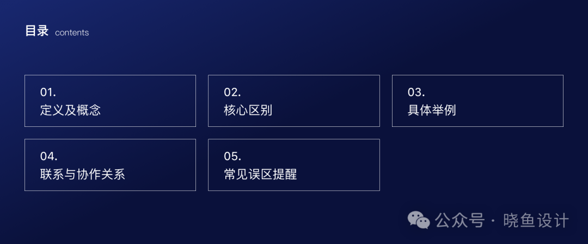
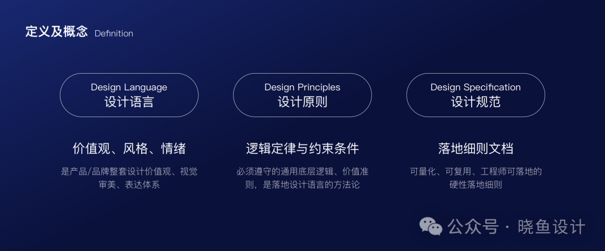
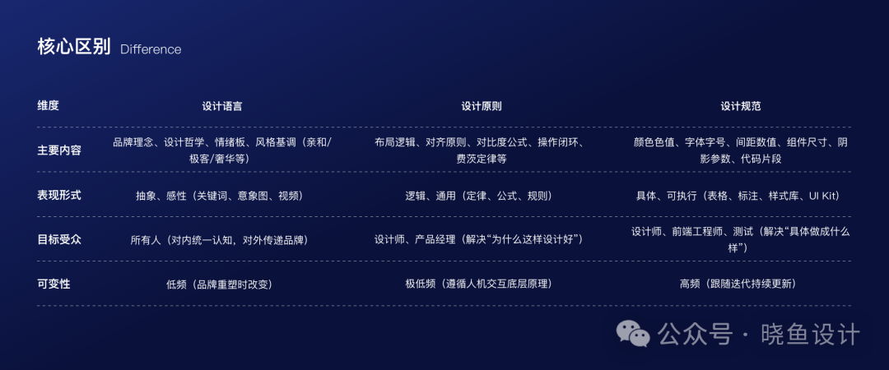
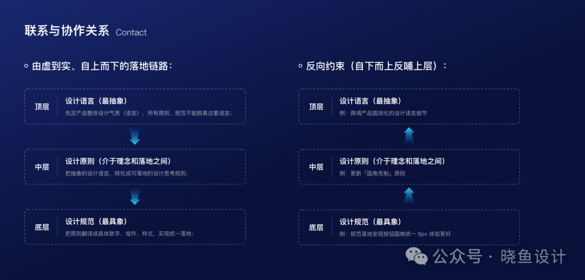

这是一个非常专业且实用的问题。在设计和开发协同工作中，这三个概念经常被混淆。简单来说，它们处于不同抽象层级，共同构成了设计系统的核心。

下面详细拆解它们的区别与联系：

**一、定义及概念**

**1.1 设计语言**

是产品/品牌整套设计价值观、视觉审美、表达体系，是一套完整的「设计世界观」，偏向美学与产品气质，决定产品长什么样、气质是什么。

解决问题：产品整体气质、品牌辨识度（为什么产品长成这样）。

**1.2 设计原则**

从设计语言中提炼出来、所有设计必须遵守的通用底层逻辑、价值准则，是落地设计语言的方法论。

解决问题：做设计时遵循什么思路、如何做决策。

**1.3 设计规范**

基于设计原则，拆解出可量化、可复用、工程师可落地的硬性落地细则，是设计师 / 开发直接照抄执行的手册。

解决问题：具体用多大字号、什么色号、按钮尺寸、组件样式。

**二、核心区别**

**2.1 主要内容**

设计语言：品牌理念、设计哲学、情绪板、风格基调（亲和/极客/奢华等）。

设计原则：布局逻辑、对齐原则、对比度公式、操作闭环、费茨定律等。

设计规范：颜色色值、字体字号、间距数值、组件尺寸、阴影参数、代码片段。

**2.2 表现形式**

设计语言：抽象、感性（关键词、意象图、视频）。

设计原则：逻辑、通用（定律、公式、规则）。

设计规范：具体、可执行（表格、标注、样式库、UI Kit）。

**2.3 目标受众**

设计语言：所有人（对内统一认知，对外传递品牌）。

设计原则：设计师、产品经理（解决“为什么这样设计好”）。

设计规范：设计师、前端工程师、测试（解决“具体做成什么样”）。

**2.4 可变性**

设计语言：低频（品牌重塑时改变）。

设计原则：极低频（遵循人机交互底层原理）。

设计规范：高频（跟随迭代持续更新）。

**三、具体例子**

假设一个产品是科技金融类App，以“按钮”为例：

**设计语言：**

我们要体现专业、安全、高效。色彩偏冷峻的蓝，交互要有干脆利落的动效，整体传达精密仪器般的信任感。

**设计原则：**

规则1：重要操作（如“确认转账”）必须用实心高对比色按钮；次要操作（如“查看明细”）用线框按钮；危险操作（如“删除”）用红色文字按钮。

规则2：按钮按下必须有0.1秒的视觉反馈（颜色变深或缩放）。

规则3：按钮热区不小于44×44pt（符合人机工程学）。

**设计规范：**

主要按钮：背景色 [#0066FF](javascript:;)，圆角 8px，内边距 12px 24px，字号 16px，字重 Medium，文字颜色 [#FFFFFF](javascript:;)。

悬停态：背景色 [#0052CC](javascript:;)；禁用态：背景色 [#CCE0FF](javascript:;)，文字 [#99B8FF](javascript:;)。

（同时提供对应的iOS/安卓/Figma/HTML/CSS代码值）

**四、联系与协作关系**

**4.1 由虚到实、自上而下的落地链路**

**设计语言=顶层（最抽象）**

先定产品整体设计气质（语言），所有原则、规范不能脱离这套语言；

例：产品走「极简克制」设计语言→不能出现繁杂花哨的规范。

**设计原则=中层（介于理念和落地之间）**

把抽象的设计语言，转化成可落地的设计思考规则；

例：极简语言→提炼原则「少装饰、高留白、精简元素」。

**设计规范=底层（最具象）**

把原则翻译成具体数字、组件、样式，实现统一落地；

例：「高留白原则」→规范：卡片内外边距 16px、模块间距 24px。

**4.2 反向约束（自下而上反哺上层）**

落地规范落地遇到问题时，反过来优化设计原则，迭代完善整套设计语言：

例：规范落地发现按钮圆角统一 8px 体验更好→更新「圆角克制」原则→微调产品圆润化的设计语言细节。

**五、常见误区提醒**

**5.1 把规范当作语言**

团队只做了颜色和间距的规范表格，没有提炼背后的规则和品牌理念。这会导致设计虽然“整齐划一”，但缺少灵魂，遇到新组件时不知如何扩展（因为不知道底层规则）。

**5.2 有规则无规范**

团队知道“按钮要有层次”，但每个设计师给出的具体圆角、颜色、阴影都不同。开发实现时每个页面都需要重新适配，效率极低。

**5.3 语言与规范割裂**

设计语言宣称“高效、简洁”，但规范里到处都是装饰性元素、8种蓝色、5个不同圆角值，实际产品就难以体现语言意图。

---

**总结：**

**从属**：规范服从原则，原则服从设计语言；三者同属一套设计体系；

**作用**：语言定方向，原则定思路，规范定落地；

**落地顺序**：先确立设计语言→梳理设计原则→输出设计规范 & 组件库。

好的设计系统 = 统一的设计语言 + 清晰的设计规则 + 详尽的设计规范。缺少任何一个，都可能导致产品体验松散、开发落地混乱，或团队协作出现偏差。

