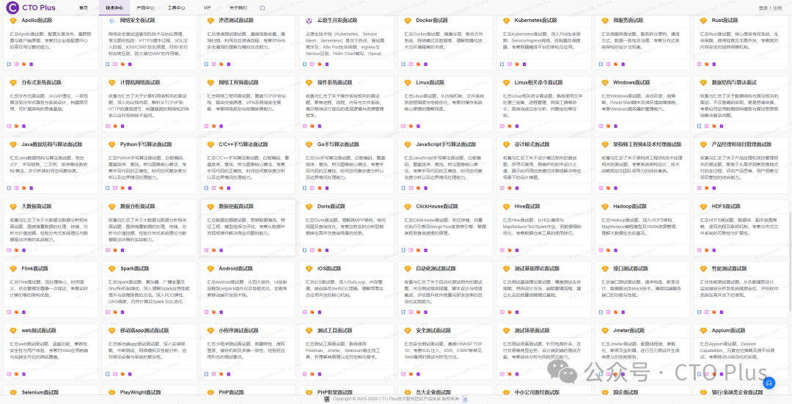
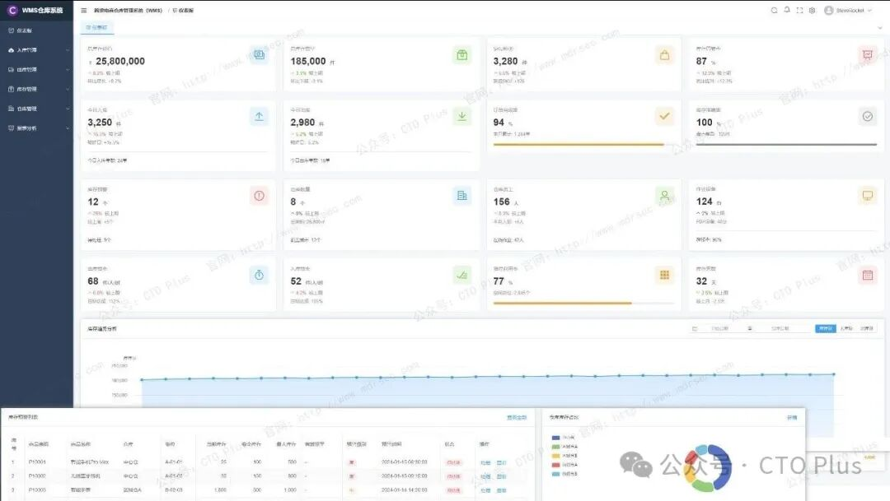
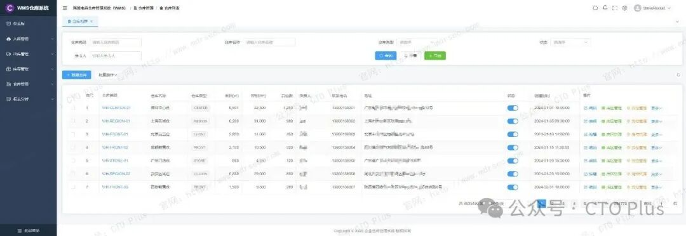
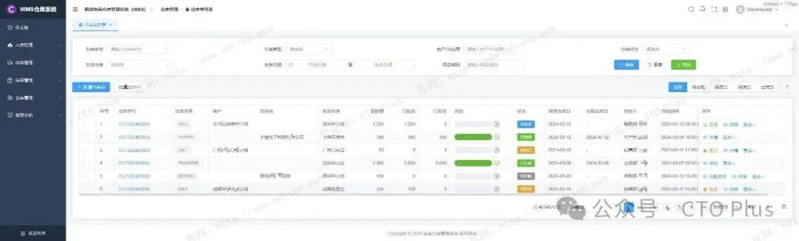
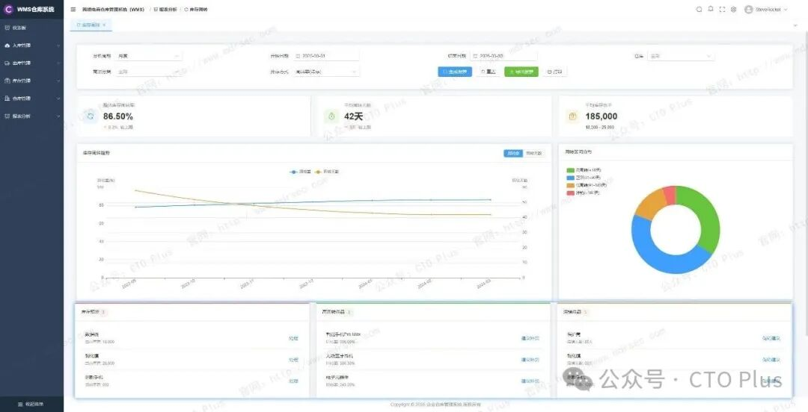
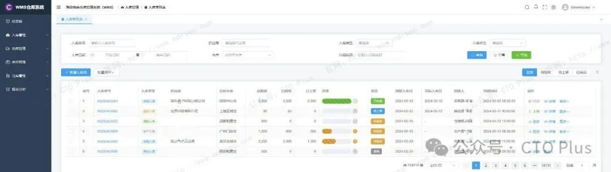

这里我将为大家介绍下我们自研的 跨境电商企业级仓库管理系统WMS 的核心功能介绍

在跨境电商年复合增长率持续攀升的背景下，海外仓已成为供应链竞争的关键节点。然而，跨境仓储的复杂度远超国内场景：多国法规差异、多平台订单协同、多时区库存同步、多币种结算等挑战交织叠加。传统的人工+Excel管理模式在此环境下已难以为继——库存不准导致超卖、拣货效率拖垮履约时效、合规疏漏引发罚款，这些问题直接侵蚀利润与客户信任。

我们的WMS（Warehouse Management System，仓库管理系统） 通过数字化手段重构仓储作业全流程，将海外仓从人力密集的成本中心转化为数据驱动的效率引擎。这里我将系统性地为大家介绍我们跨境电商WMS系统具备的核心功能模块与技术特性

产品定位提示：WMS与ERP并非替代关系——ERP统筹“人财物”的宏观规划，WMS专注仓库现场的精细化执行，两者形成“规划-执行-反馈”的闭环，缺一不可 。

核心功能模块

具体功能欢迎联系我们咨询，欢迎合作🤝 http://www.mdrsec.com 官方出品

入库管理

入库是仓储作业的起点，直接决定了后续库存准确率和作业效率。跨境电商场景下的入库管理需应对多货源（工厂直发、FBA中转、退货返仓）、多物流方式（海运整柜、空运散货、快递包裹）的复杂情况。

预约与ASN管理 系统应支持货主提前推送ASN（预先发货通知），仓库可据此预判到货量、安排收货资源（人力、叉车、暂存区），避免码头拥堵和资源闲置。某系统实测表明，ASN管理可使收货效率提升30%以上 。

智能收货与质检

通过PDA扫描箱唛/物流单号快速识别货主、SKU及数量，系统自动比对ASN数据，异常差异实时预警

质检结果结构化记录（合格/瑕疵/临期），支持按规则自动分流——良品进入上架流程，残次品隔离至冻结库位

支持批次号/序列号/效期采集，为后续FIFO（先进先出）和全程溯源建立数据基础

智能上架推荐 系统根据SKU属性（体积、重量、热销度、效期）和库容状态，自动推荐最优库位。规则引擎可配置：热销品推荐靠近打包区的拣选位、重货推荐底层储位、效期短商品优先出库位。某跨境大卖应用智能上架后，库位利用率提升35%，上架效率提升50% 。

库存管理

库存管理是WMS的核心中枢，需实现多维度、多层级、多状态的实时库存视图，并支持跨国多仓协同。

多维度库存视图 系统应支持按货主、SKU、批次、库位、仓库、国家等维度自由组合查询库存，且数据延迟控制在秒级。对于多仓运营的服务商，还需支持“逻辑库存”与“物理库存”的分层管理——前者面向平台/ERP展示可售数量，后者精确到库位级实物数量 。

库存状态机管理 将库存状态细分为：在途、待质检、待上架、可售、锁定（订单占用）、冻结（残次/临期）、已拣货待出库等。状态流转须与作业节点强关联，确保账实一致。行业标杆系统的库存准确率可达99.6%以上 。

智能预警与补货

安全库存预警：低于阈值自动触发补货提醒

效期预警：按FIFO规则临期自动提示，减少过期损失

滞销预警：库龄超限SKU自动推送，辅助清仓决策

智能补货算法：结合历史销量、季节性、促销计划预测需求，库存周转率可提升45%

库位优化与理货 系统应定期分析SKU热度变化，生成理货任务——将热销品移至黄金库位、滞销品移至高架深层储位。某系统实测表明，动态理货可使拣货路径减少22% 。

出库管理

出库环节是履约时效的核心战场，WMS需在“快”与“准”之间取得平衡。

多渠道订单整合 系统需预置对接主流电商平台（Amazon、TikTok Shop、Shopee、Temu、Shein等）和ERP系统的API接口，实现订单自动拉取、去重、合并。某系统支持20+平台订单直连，人工录入环节归零 。

智能波次与拣货策略 这是出库效率的核心引擎。系统应支持多种波次生成规则：

按订单类型（单品/多品、普通/紧急）

按物流渠道（DHL/UPS/本地快递）

按拣货区/存储区分离策略

按拣货容器容量自动分割

波次生成后，系统计算最优拣货路径，减少拣货员行走距离。数据显示，智能波次可将拣货效率提升50%-80% 。

二次核验与防错机制

打包台扫描SKU条码，系统自动比对订单明细，错漏实时报警

支持打包视频录制，订单争议时可追溯作业录像，规避索赔纠纷

自动称重比对：打包后过磅，重量与理论值偏差超阈值则拦截

智能包材推荐 系统根据订单商品的体积、重量、品类自动推荐最优包材规格，减少耗材浪费和物流成本超支。某系统实测包材成本降低15% 。

物流渠道智能匹配 对接50+国际物流商API，根据目的国、时效等级、成本约束自动比价推荐最优渠道。支持预设面单模板、一键打印、物流轨迹自动回传 。

逆向物流管理：退货处理的标准化闭环

跨境电商退货成本高昂（物流+仓储+关税），高效的RMA（退货授权）管理是WMS的重要竞争力。

具体功能欢迎联系我们咨询，欢迎合作🤝 http://www.mdrsec.com 官方出品

CTO Plus技术服务栈 自研产品清单

[#资产安全配置管理系统](javascript:;) [#SCMDB](javascript:;)

[#终端侦测与响应系统](javascript:;) [#EDR](javascript:;)

[#网络侦测与响应系统](javascript:;) [#NDR](javascript:;)

[#企业网络资产攻击面管理系统](javascript:;) [#CAASM](javascript:;)

[#资产暴露面管理系统](javascript:;) [#AEMS](javascript:;)

[#网络安全蜜罐管理系统](javascript:;) [#HoneyPot](javascript:;)

[#安全事件收集与告警管理系统](javascript:;) [#SIEM](javascript:;)

[#扩展侦测与响应系统](javascript:;) [#XDR](javascript:;)

[#多引擎脆弱性扫描系统](javascript:;) [#VAS](javascript:;)

[#多源日志审计监测系统](javascript:;) [#LAS](javascript:;)

[#网络安全威胁情报中心](javascript:;) [#TIS](javascript:;)

[#网络安全漏洞库管理系统](javascript:;) [#VDBS](javascript:;)

[#网络安全编排与自动化响应](javascript:;) [#SOAR](javascript:;)

[#威胁狩猎系统](javascript:;) [#THS](javascript:;)

[#数据库安全审计系统](javascript:;) [#DSAS](javascript:;)

[#智能体安全态势管理系统](javascript:;) [#AISPM](javascript:;)

[#Web防火墙](javascript:;) [#WAF](javascript:;)

[#网站安全监测平台](javascript:;) [#WSM](javascript:;)

[#网络安全态势感知平台](javascript:;) [#SSAP](javascript:;)

[#网络安全自动化应急响应工具系统](javascript:;) [#NSRT](javascript:;)

[#企业网络安全运维工具系统](javascript:;) [#SecTools](javascript:;)

[#网络安全自动化等保测评系统](javascript:;) [#ASES](javascript:;)

[#浏览器安全监测防护系统](javascript:;) [#BSMPS](javascript:;)

[#网络安全用户实体行为分析系统](javascript:;) [#UEBA](javascript:;)

[#互联网电信诈骗预警防护系统](javascript:;) [#TPFWS](javascript:;)

[#云原生安全管理平台](javascript:;) [#CNAPP](javascript:;)

[#自动化渗透测试系统](javascript:;) [#PTS](javascript:;)

[#工业企业信息安全监测中心](javascript:;) [#IoT](javascript:;) SOC

[#企业智能安全运营中心](javascript:;) [#AISOC](javascript:;)

[#持续构建与发布系统](javascript:;) [#CICD](javascript:;)

[#资产配置管理系统](javascript:;) [#CMDB](javascript:;)

[#域名管理系统](javascript:;)

[#LDAP管理系统](javascript:;)

[#SSL证书管理系统](javascript:;)

[#短网址系统](javascript:;)

[#自动化巡检系统](javascript:;)

[#运维工单系统](javascript:;)

[#ES管理系统](javascript:;)

[#Kafka管理系统](javascript:;)

[#RocketMQ管理系统](javascript:;)

[#数据库管理系统](javascript:;)

[#运维智能监控告警管理平台](javascript:;) [#AIMAMS](javascript:;)

[#企业网络工具系统](javascript:;) [#NTools](javascript:;)

[#自动化测试系统](javascript:;) [#AutoTest](javascript:;)

[#自动化运维系统](javascript:;) [#AutoOps](javascript:;)

[#企业运维工具系统](javascript:;) [#OpsTools](javascript:;)

[#物联网管理系统](javascript:;) [#IoTS](javascript:;)

[#软件开发生命周期管理系统](javascript:;) [#SDLC](javascript:;)

[#IT流程管理系统](javascript:;) [#ITSM](javascript:;)

[#自动化运维备份系统](javascript:;)

[#自动化运维配置变更管理系统](javascript:;)

[#企业制造执行管理系统](javascript:;) [#MES](javascript:;)

[#制造执行管理系统](javascript:;)（MES）汽车/零部件行业

[#制造执行管理系统](javascript:;)（MES）电子/半导体行业

[#企业运输管理系统](javascript:;) [#TMS](javascript:;)

[#跨境电商企业资源管理系统](javascript:;) [#ERP](javascript:;)

[#企业客户关系管理系统](javascript:;) [#CRM](javascript:;)

[#跨境电商仓库管理系统](javascript:;) [#WMS](javascript:;)

[#企业财务管理系统](javascript:;) [#FMS](javascript:;)

[#企业质量管理系统](javascript:;) [#QMS](javascript:;)

[#精准营销管理系统](javascript:;) [#PMS](javascript:;)

[#智能生产管理系统](javascript:;) [#SPMS](javascript:;)

[#企业工单](javascript:;)（HR·OA）系统

[#产品生命周期管理系统](javascript:;) [#PLM](javascript:;)

[#供应链管理系统](javascript:;) [#SCM](javascript:;)

[#供应商关系管理](javascript:;) [#SRM](javascript:;)

[#订单管理系统](javascript:;) [#OMS](javascript:;)

[#电商BI系统](javascript:;) [#BI](javascript:;)