# 库存有时候是铁疙瘩，有时候是一罐油，但仓库看库存，讲来讲去都停在一个词上：数量。

# 仓里有多少，能发多少，还差多少。可一旦业务稍微复杂一点，光靠数量就开始失真：同样是一百件料，有的能用，有的不能用；有的是这一批，有的是那一批；有的已经承诺给客户，有的只能给项目；有的甚至不是“这一类货”，而是“这一个具体实物”。到这一步，你会发现，库存真正难管的从来不是数量，而是**身份**。

# 

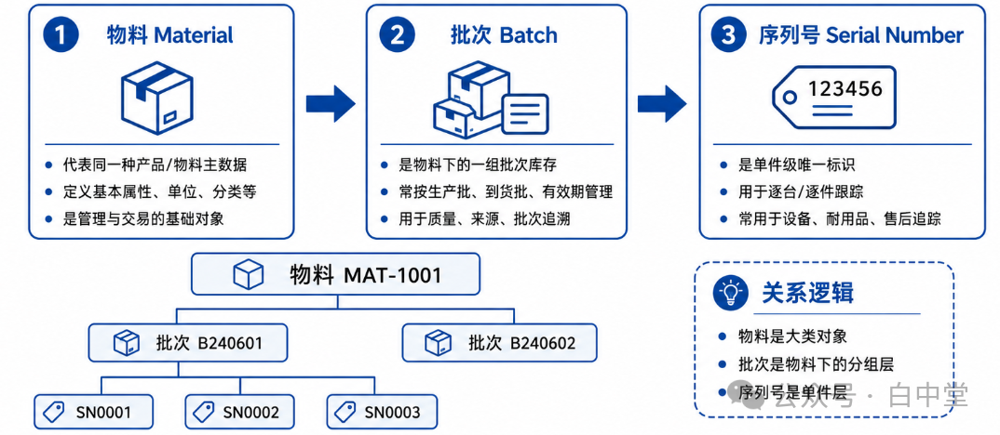

# 

SAP 在库存管理上真正高明的地方，就在于它从不把库存当成一堆散数字，而是把库存当成一个分层对象来管理。这个分层，最核心的一条线，就是：**物料、批次、序列号**。物料回答“这是什么”，批次回答“这是哪一批”，序列号回答“这是哪一个”。这不是三个字段，而是三层不同粒度的业务身份体系。

## 一、第一层：物料，是库存世界的主身份

## 

SAP 所有库存管理，第一前提都不是仓位，也不是状态，而是**物料号**。

因为系统首先要知道：这到底是什么东西，它属于哪一类业务对象，它的基本计量单位是什么，它怎么被采购、生产、销售、估值和计划。没有物料号，就没有库存对象；有了物料号，后面的批次和序列号才有依附的基础。

[[谈个对象]聊聊SAP物料-Material](https://mp.weixin.qq.com/s?__biz=MzI1NjQ2NTc3MA==&mid=2247486223&idx=2&sn=5062b35f0c87b884126c8c05dca8c5bd&scene=21#wechat_redirect)

[物料-批-序列号 库存管理的分层管：这批货到底是谁](https://mp.weixin.qq.com/s?__biz=MzI1NjQ2NTc3MA==&mid=2247495260&idx=2&sn=96976e44ec1e9e521fe425160f24b1f5&scene=21#wechat_redirect)

这也是为什么 SAP 里很多看似“库存动作”，本质上其实是“身份动作”。最典型的就是**物料到物料的转移过账**。如果一项实物经过熟化、转化、重新归类，已经不再符合原物料号定义，而应该按另一个物料号来管理，SAP 要求你做的不是“改名”，而是正式的调拨过账。

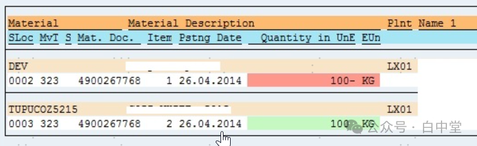

它只能从发出方物料的非限制使用库存转到接收方物料的非限制使用库存，两个物料基础计量单位必须一致，过账后系统会同时生成物料凭证和会计凭证。也就是说，在 SAP 看来，物料号不是标签，而是库存主身份。

所以，物料层解决的不是追溯细节，而是更根本的问题：**这东西在企业里到底算什么。**

MRP 先按物料算供需，采购订单先按物料下单，生产订单先按物料发料收货，会计估值也先按物料走。物料层，是库存世界的主语。

## 二、第二层：批次，是群体身份，不是细一点的物料号

## 

如果说物料是大类，那批次就是**同类中的这一群**。  
它解决的不是“这是什么东西”，而是“同一种东西里，这一群和另一群有什么业务差别”。

[[谈个对象]聊聊 SAP Batch 批次](https://mp.weixin.qq.com/s?__biz=MzI1NjQ2NTc3MA==&mid=2247494627&idx=4&sn=9d09d5c6e20931f22565433148b1f060&scene=21#wechat_redirect)

[[干货]SAP简化库龄表设计方案-启用批次管理](https://mp.weixin.qq.com/s?__biz=MzI1NjQ2NTc3MA==&mid=2247495035&idx=3&sn=16caced8ac398b4d475f168952d452c9&scene=21#wechat_redirect)

[全价值链批次级追溯可实施可落地的业务设计方案](https://mp.weixin.qq.com/s?__biz=MzI1NjQ2NTc3MA==&mid=2247495590&idx=2&sn=f215f08a587bf1285dd5179b2b359d20&scene=21#wechat_redirect)

[机械论的好学生SAP条件技术：以批次确定为例](https://mp.weixin.qq.com/s?__biz=MzI1NjQ2NTc3MA==&mid=2247485433&idx=1&sn=2d822fbaec0638b5674574bfdab4f375&scene=21#wechat_redirect)

化工、制药、食品、电子元件这些行业特别依赖批次，因为同一个物料号下，不同到货批、生产批、炉次、效期、来源、检验结果都可能不同。SAP 之所以单独设计批次层，就是为了在不把物料主数据炸裂的情况下，把这些差异稳稳接住。

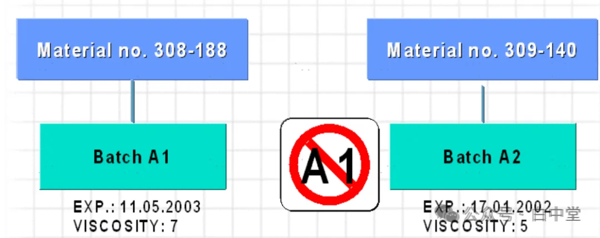

但 SAP 对批次的设计并不粗暴。它并没有把批次理解成“再细一点的物料号”，而是把批次定义成一个有属性、能参与判断、能触发系统动作的业务对象。

最典型的例子，就是**批次状态管理**：系统把批次区分为“非限制使用”和“限制使用”两种状态，这个状态集中存储在批次上，并且作为批次分类特征参与批次确定。新批次收货时默认是非限制使用；后续可以由 QM 使用决策，或者通过更改批次，把它改成限制使用。

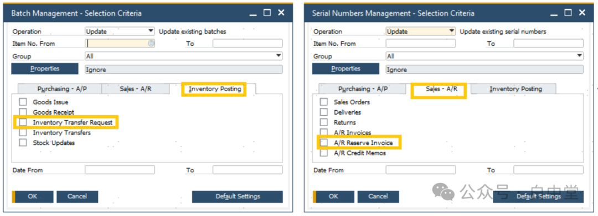

更妙的是，SAP 没有把批次状态和库存类型混成一回事。  
一个批次的总库存，要么是非限制使用库存，要么是限制使用库存，不能同时两种并存；如果只想把其中一部分数量改成限制使用，必须通过转移过账分到另一个批次里。

[SAP库存查看三视角：特殊库存+库存类型+过程状态](https://mp.weixin.qq.com/s?__biz=MzI1NjQ2NTc3MA==&mid=2247496138&idx=2&sn=a7f13f33418e9c5f44afffccf46f9048&scene=21#wechat_redirect)

但与此同时，这个批次仍然可以叠加质检库存和冻结库存。也就是说，SAP 在批次层管的是“这批允许怎么用”，在库存类型层管的是“这批当前能不能用”。两层叠加，但彼此独立。

这就是批次层真正的价值：  
它不是记一个号码，而是让系统具备三种能力：**追溯、选择、控制**。出了质量问题，追的是哪一批，不是整个物料；执行批次确定时，系统可以自动排除限制使用的批次或优先挑选符合用途的批次；当批次状态被更改时，系统不是改备注，而是自动触发转移过账并生成物料凭证。

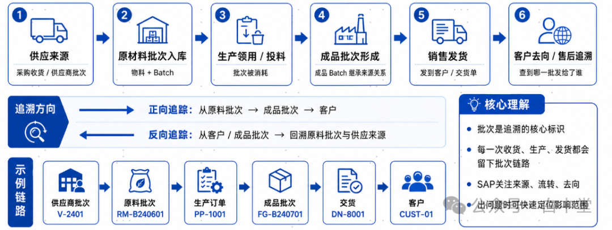

所以一句话：**批次层解决的是群体差异。**  
同物料、不同批，是供应链世界里最常见、也最容易被低估的一种真实复杂性。

## 三、第三层：序列号，是单件身份

## 

到了序列号层，库存管理的颗粒度就从“这一群”下沉到“这一个”。  
它回答的不是“这是什么料”，也不是“这是哪一批”，而是：**这到底是哪一件。**

**[[谈个对象]聊聊 SAP Serial Number 序列号](https://mp.weixin.qq.com/s?__biz=MzI1NjQ2NTc3MA==&mid=2247495344&idx=4&sn=6d4dacef6ce58e63763a657e62c97984&scene=21#wechat_redirect)**

笔记本电脑、服务器、医疗设备、高值备件、售后维修件、安装设备，这些业务都要求你能精确识别每一个物理单体。客户买走的是其中哪一台？返修回来的是不是原来那一台？保修开始的是哪一台？安装在现场的是哪一台？这些问题，批次解决不了，物料更解决不了，只能靠序列号。

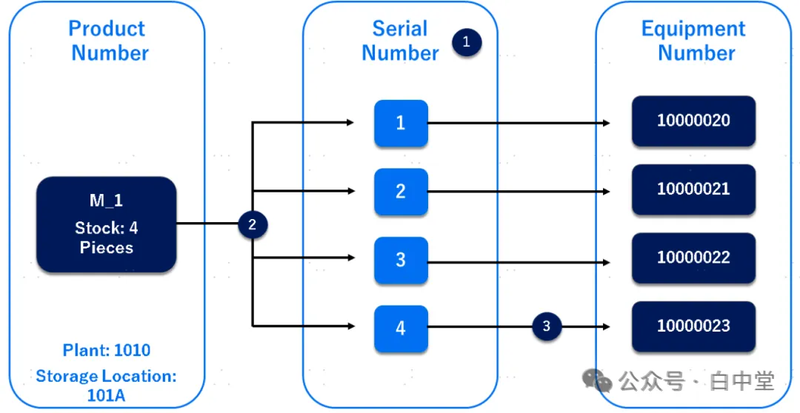

这里要把一个误区钉死：**序列号不是“更细的批次”。**  
批次是同质群管理，批次内部通常可替代；序列号是单体生命周期管理，单件之间天然不可互换。批次解决的是“这一群同类货有不同业务属性”，序列号解决的是“这一件实物有独立履历”。

因此，序列号层最核心的价值，不在库存总量，而在单件生命周期：  
单件收货、单件发货、单件安装、单件保修、单件维修、单件退货、单件报废、单件历史追溯。它让库存从“物料账”变成“实物账”。

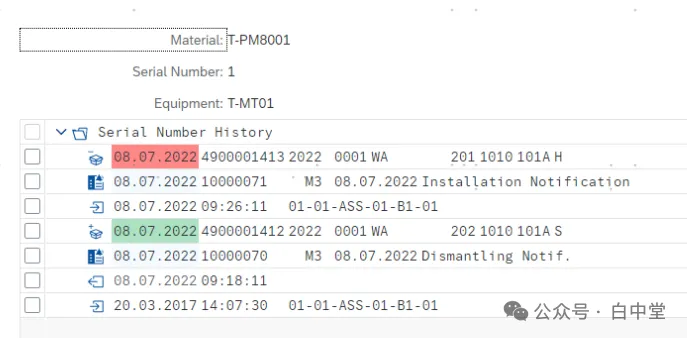

物料管类别身份，批次管群体身份，序列号管单件身份。但序列号一定依附于某个 Material。没有物料本体，单独一个序列号没有业务意义。

所以序列号不是独立于物料存在的“产品身份体系”，而是“某个物料下某个单件实例”的身份标识。

## 四、为什么一定要分三层，而不是一层到底

## 

这恰恰是 SAP 最成熟的地方。它没有说“既然都要追溯，那就全部按单件来管”；也没有偷懒到“所有东西都只按物料号管”。它给出的，是一套**按业务需要逐层加细**的对象架构。

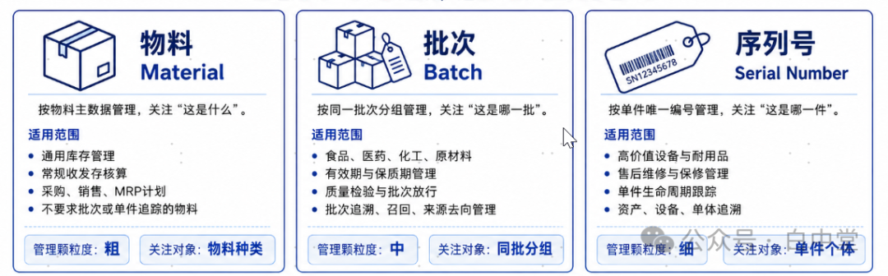

只用物料层，适合大宗原料、低值辅料、普通散料，简单、快、便宜。  
物料加批次，适合需要效期、炉次、来源、检验结果、批次追溯的行业。  
物料加序列号，适合设备、电子、售后、资产类业务。  
三层全开，则适合既要批量追溯、又要单件追踪的高监管行业和高价值设备场景。

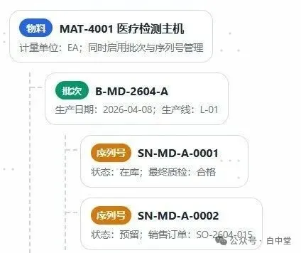

SAP 的克制就在这里：  
**能在物料层解决的，不逼你上批次；能在批次层解决的，不滥用序列号。**  
它追求的不是“越细越高级”，而是“刚好够用，且始终可追”。这是一种非常典型的企业级架构思维。

## 五、这三层不是孤立存在，而是能接进同一条库存交易骨架

## 

SAP 的厉害，还不只是把三层分出来，而是让三层都能挂在**同一条库存交易骨架**上。  
这条骨架，就是货物移动、调拨过账、物料凭证。

物料到物料转移过账是物料层的身份变化；批次状态变更会自动触发转移过账并生成物料凭证；库存类型的变化也通过标准移动类型完成，比如质检释放 321、冻结释放 343、冻结转质检 349。

SAP 不是为每一层对象单独造一套流程，而是让不同粒度的身份，都落在统一的货物移动语法里。

[Everything is a Material Document 一切库存移动都是物料凭证](https://mp.weixin.qq.com/s?__biz=MzI1NjQ2NTc3MA==&mid=2247494826&idx=3&sn=73d4148bd986ca68874a73093a661748&scene=21#wechat_redirect)

这就产生了一个非常漂亮的架构效果：  
**底层统一，表层分层。**

对象粒度可以不同，但过账骨架是一致的；业务场景可以不同，但凭证留痕是统一的；于是系统既有足够强的表达力，又不会因为业务一复杂就裂成很多孤岛。

## 六、再把它叠回 SAP 的多维库存模型里，你就能看见它真正的威力

## 

SAP 库存管理，原本就不是单维的。

[SAP库存分类全貌：工厂 + 库存地点 + 特殊库存 + 库存类型](https://mp.weixin.qq.com/s?__biz=MzI1NjQ2NTc3MA==&mid=2247496210&idx=2&sn=196473255b92aaa0da7e961a1cf7a0d2&scene=21#wechat_redirect)

工厂管责任边界，库存地点管物理位置，特殊库存管所有权和预留关系，库存类型管当前可用状态。一个完整库存对象，已经不是“某物料有多少”，而是“某物料在某工厂、某库存地点、属于某特殊库存、当前处于某库存类型”。

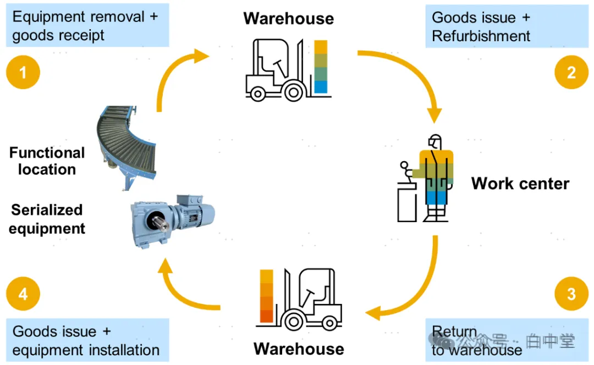

现在再把物料、批次、序列号三层身份体系叠上去，这个对象就变成：

* 它是什么：物料
* 它是哪一批：批次
* 它是哪一件：序列号
* 它在哪：工厂、库存地点
* 它是谁的：特殊库存
* 它现在能不能用：库存类型

这时候，SAP 管的早就不是“库存数量”，而是一个完整的库存对象宇宙。  
你问系统的，也不再只是“还有多少”，而是：

* 这批货到底是什么；
* 它属于哪一批；
* 它是不是那一件；
* 它在哪个工厂、哪个库位；
* 它是谁的；
* 它当前能不能被正常使用；
* 它为什么能用，或者为什么不能用。

这才是 SAP 库存设计最有力量的地方。

## 七、这种设计到底带来什么管理价值

## 

第一，**追溯能力是分级的**。  
不是所有物料都必须追到件，但该追到批的能追到批，该追到件的能追到件。企业不会被过度管理拖死，也不会在出事时毫无抓手。

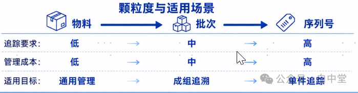

第二，**计划和执行各有抓手**。  
MRP 主要站在物料层看供需，批次层承接质量、来源、效期和批次选择，序列号层承接售后、维修、安装和单件责任。不同粒度各司其职，不互相拖累。

第三，**问题范围能被迅速缩小**。  
出问题时，不必一刀切封死整个物料；你可以只冻结那一批，甚至只追到那一件。系统能把库存可视化做到“显微镜”级别，把控制做到“手术刀”级别。

第四，**架构本身是低耦合的**。  
工厂、库存地点、特殊库存、库存类型是正交的；状态和关系彼此独立变化；所有库存操作基于统一的数据模型和接口来处理。把物料、批次、序列号三层再叠上去，本质上仍然是“每一层只负责一种复杂性”。

这就是为什么 SAP 可以同时支撑普通制造、批次监管行业、高值设备行业、项目制行业，而底层库存架构却不需要被推翻重来。

## 八、SAP 为什么一定要分三层

因为库存管理真正要管的，从来不是“有多少”，而是“**这批货到底是谁**”。

物料层，回答“它是什么”；  
批次层，回答“它是哪一群”；  
序列号层，回答“它是哪一个”。

再叠加工厂、库存地点、特殊库存、库存类型，SAP 才终于把现实世界里最难缠的几件事如身份、位置、状态、归属、责任，从一锅乱麻，拆成了清清楚楚的几根线。

物料到物料转移过账强化了“物料号就是主身份”的严肃性；批次状态管理把控制从库存状态下沉到批次属性；库存类型又通过标准移动类型把可用性和流程一体化地串起来。

所以 SAP 库存设计真正高级的地方，不是字段多，也不是移动类型多，而是它始终在做一件事：

**把库存从数字，变成对象；  
再把对象，从模糊，变成有分辨率的身份。**